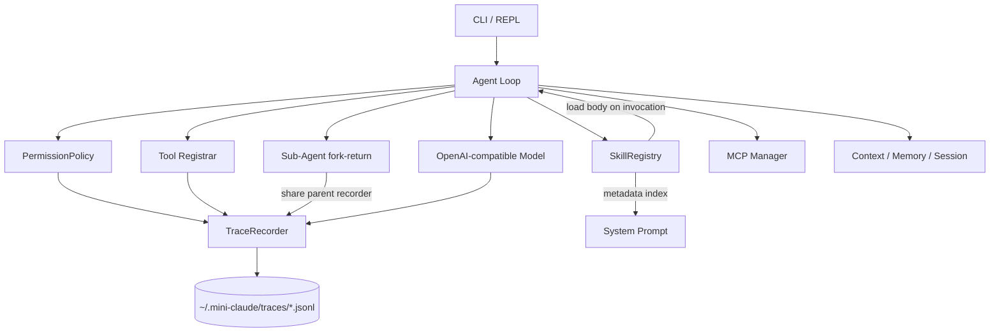
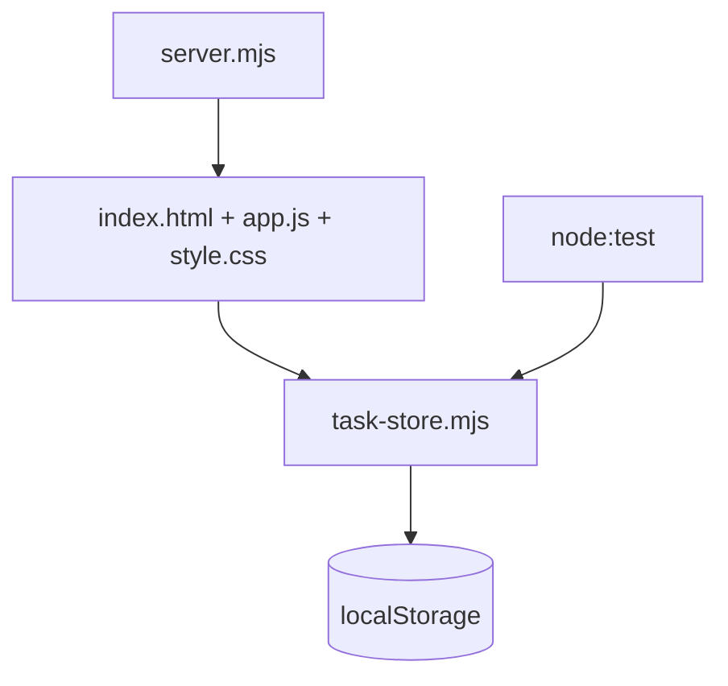

# Mini Claude Code 实战：权限、Skills、可观测性与多 Agent

> 在 06 的完整 Agent 基线上继续打磨，重点完成声明式权限、Skills 懒加载和本地可观测性。项目保持 JavaScript ESM、零第三方依赖，并兼容 OpenAI 风格的 `chat/completions` 接口。

## 这次新增

06 已经具备 Agent Loop、Plan Mode、Sub-Agent、MCP、记忆、上下文压缩和基础 Skills。08 不重复造一遍，而是在独立可运行副本上增加三条产品化能力：

| 方向 | 新能力 | 用户能看到的结果 |
|---|---|---|
| 权限系统 | 字符串/对象规则、`*` 通配、稳定 `reasonCode`、规则说明、运行时刷新 | `/permissions` 查看规则；每次判断进入 Trace |
| Skills | 发现时只建立元数据索引，调用时读取正文，项目级覆盖用户级，运行时刷新 | `/skills`、`/skills refresh`、`/review ...` |
| 可观测性 | 模型、工具、权限、技能、子 Agent 的 JSONL 事件；耗时、用量、估算成本、输出大小；自动脱敏 | `/trace 20` 查看最近事件，`--no-trace` 可关闭 |

同时修复了一个从 06 带来的边缘问题：fork Skill 现在回填子 Agent 的文本结果，而不是把 `{ text }` 对象直接塞进工具消息。

## 架构图



三个新增模块都采用“小接口、深实现”的形状：

- `PermissionPolicy.evaluate()` 隐藏规则解析、优先级、五种模式和危险检测。
- `SkillRegistry.list()/resolveInvocation()/execute()/refresh()` 隐藏目录覆盖、frontmatter、inline/fork 和正文加载时机。
- `TraceRecorder.record()/recent()/formatRecent()` 隐藏 JSONL、事件序号、截断、脱敏和写入失败降级。

## 免 Key 演示

```powershell
git clone https://github.com/XVSHIFU/ai-agent-learning.git
cd .\ai-agent-learning\08-综合项目
node --version
node demo.mjs
```

建议使用 Node.js 24 或更高版本；本项目在 Node.js 24 上完成验证。

演示会依次输出：

1. `deny` 规则在 `bypassPermissions` 下仍然生效；
2. 项目 Skill 的元数据发现和正文展开；
3. 两轮 mock Agent Loop；
4. 模型、工具和权限产生的最近 Trace。

`demo.mjs` 只在系统临时目录写 Trace，结束后自动清理，不需要 API Key。


## 运行真实 Agent

以下命令接着上面的快速开始执行；如果你回到了仓库根目录，先进入 `08-综合项目`。

```powershell
$env:AGENT_API_KEY = "sk-xxx"

# 单次任务
node src\cli.mjs --yolo "读取 src/trace.mjs，总结它如何保护敏感信息"

# REPL
node src\cli.mjs

# 免 Key 验证 Agent Loop
node src\cli.mjs --mock "读取 greeting.txt"
```


可选环境变量：

| 变量 | 默认值 | 用途 |
|---|---|---|
| `AGENT_API_KEY` | 无 | OpenAI 兼容接口密钥 |
| `AGENT_BASE_URL` | `https://api.deepseek.com/v1` | API 基址 |
| `AGENT_MODEL` | `deepseek-v4-flash` | 模型名 |

常用参数：`--plan`、`--yolo`、`--accept-edits`、`--dont-ask`、`--max-turns N`、`--resume`、`--no-trace`。

## 权限系统

### 五种模式

| 模式 | 行为 |
|---|---|
| `default` | 读操作直接允许，危险操作询问 |
| `plan` | 只读；唯一可写目标是当前 plan 文件 |
| `acceptEdits` | 自动允许 `write_file` / `edit_file`，危险 shell 仍询问 |
| `bypassPermissions` | 跳过普通确认，但显式 deny 和 plan 契约仍优先 |
| `dontAsk` | 本应询问的操作自动拒绝，适合无人值守的保守运行 |

规则优先级：

```text
deny → plan 只读契约 → bypass → allow → 模式/危险检测 → 默认允许
```

MCP 工具的副作用无法从旧协议定义中可靠判断，因此 plan 模式会保守拒绝所有 `mcp__*` 调用。`agent`、`skill` 和 MCP 在真正执行前都会经过同一个权限闸；fork 出来的执行者继承显式 deny，plan 下继续保持只读。

### 声明式规则

将 `.claude/settings.example.json` 复制为 `.claude/settings.json` 后生效。旧字符串格式和新对象格式可以混用：

```json
{
  "permissions": {
    "allow": [
      "read_file",
      { "tool": "run_shell", "pattern": "node --test*", "reason": "允许执行测试" }
    ],
    "deny": [
      "run_shell(rm -rf*)",
      { "tool": "run_shell", "pattern": "git push*", "reason": "推送必须人工执行" }
    ]
  }
}
```

对象规则的 `pattern` 支持 `*` 通配。规则命中后会返回 `rule_allow` 或 `rule_deny`，并把 `reason` 写入权限审计事件。

REPL 中输入 `/permissions` 查看规则数量；修改配置后输入 `/permissions refresh` 重新加载。

## Skills 懒加载

技能目录仍兼容 Claude Code 风格：

```text
.claude/skills/<skill-name>/SKILL.md
~/.claude/skills/<skill-name>/SKILL.md
```

项目技能后加载，因此同名时覆盖用户技能。发现阶段最多读取 64KB frontmatter，不把正文放入索引；`/技能名` 或模型调用 `skill` 工具时，才读取最新正文并替换：

- `$ARGUMENTS` / `${ARGUMENTS}`
- `${CLAUDE_SKILL_DIR}`

本项目自带 `.claude/skills/review/SKILL.md`：

```text
/review src/permissions.mjs
```

使用 `/skills` 查看索引，新增或删除技能后使用 `/skills refresh`；刷新同时重建当前 Agent 的 System Prompt。手动 `/技能名` 和模型的 `skill` 工具都会保留 `context` 语义：`context: fork` 在干净子 Agent 中执行，并按 `allowed-tools` 限制可见工具。

## 本地 Trace

默认路径：

```text
~/.mini-claude/traces/trace-<sessionId>.jsonl
```

主要事件：

- `model.request` / `model.response` / `model.failed`
- `tool.started` / `tool.completed` / `tool.failed`
- `permission.decision` / `permission.user_decision`
- `skill.activated`
- `subagent.started` / `subagent.completed` / `subagent.failed`

在 REPL 输入 `/trace` 或 `/trace 50` 查看当前会话最近事件。每个事件都有时间、递增序号、会话 ID 和结构化数据。Agent 事件还包含 `agentId`、`parentAgentId` 和 `spanId`，可以把父 Agent、fork Skill、Sub-Agent 及其模型/工具事件重新串起来。

`model.response` 同时记录 token usage 和 `estimatedCostCny`。它沿用本项目 `/cost` 的演示价格（输入 ¥2/百万 token、输出 ¥8/百万 token），只用于观察调用规模；真实价格应以所选模型供应商为准。

Trace 会递归隐藏 `apiKey`、`authorization`、`password`、`secret`、`token` 等字段，也会清理普通字符串里的 Bearer token 和 `sk-...`。长字符串截断为 2,000 字符。脱敏是防误传的第二道防线，分享日志前仍应人工检查。

## 测试

```powershell
# 08 新能力：17 条行为测试
node --test test\product-tests.mjs

# 继承自 06：26 条确定性回归
node test\unit-tests.mjs

# 一键免 Key 演示
node demo.mjs
```

手动验收见 `test/checklist.md`。测试通过公开接口验证行为，并按 RED→GREEN 的纵向切片完成。

## 项目结构

```text
08-综合项目/
├── .claude/
│   ├── settings.example.json
│   └── skills/review/SKILL.md
├── docs/adr/                 # 技术决策记录
├── src/
│   ├── agent.mjs             # Agent Loop 与 Trace 接线
│   ├── permissions.mjs       # PermissionPolicy
│   ├── skills.mjs            # SkillRegistry
│   ├── trace.mjs             # JSONL TraceRecorder
│   └── ...                   # 06 的工具/MCP/记忆/上下文等能力
├── test/
│   ├── product-tests.mjs     # 08 行为测试
│   ├── unit-tests.mjs        # 继承回归测试
│   └── checklist.md          # 手动验收
├── demo.mjs                  # 一键免 Key 演示
├── demo-script.md            # 30–60 秒录屏脚本
└── 总结.md
```

## ADR

- [ADR-0001：以 06 为独立基线](https://github.com/XVSHIFU/ai-agent-learning/blob/main/08-综合项目/docs/adr/0001-以06为独立基线.md)
- [ADR-0002：用三个深模块承载产品化能力](https://github.com/XVSHIFU/ai-agent-learning/blob/main/08-综合项目/docs/adr/0002-三个深模块.md)
- [ADR-0003：优先本地 JSONL 而不是强依赖 Langfuse](https://github.com/XVSHIFU/ai-agent-learning/blob/main/08-综合项目/docs/adr/0003-本地JSONL可观测性.md)

## 交付状态

- [x] 独立可运行代码

- [x] 架构图、使用说明和 ADR

- [x] 自动化测试与手动验收清单

- [x] 技术选型、踩坑和学习总结

  

## 设计复盘

### 我选择打磨的三件事

这次没有继续堆更多“看起来很 Agent”的功能，而是选择权限、Skills 和可观测性。原因很直接：06 已经能调用工具、拆子 Agent、接 MCP，但一个真正可交付的 Coding Agent 还必须回答三个问题：它为什么允许或拒绝一次操作？它如何在不撑大 System Prompt 的前提下扩展能力？出了问题以后如何还原执行过程？

### 技术选型

#### 1. 权限判断收进 PermissionPolicy

原实现已经有五种模式和字符串规则，但规则解析、模式判断、危险检测都挤在一个函数里，返回结果也只有 action/message。08 新增对象规则、任意位置 `*` 通配、`reason` 和稳定 `reasonCode`，再通过 `PermissionPolicy.evaluate()` 提供统一接口。

我保留了 `checkPermission()` 兼容入口。这样 Agent Loop 不需要一次性大改，旧代码和新测试也可以同时工作。

#### 2. Skills 从“缓存全文”改成“元数据索引 + 调用时正文”

06 在发现技能时读取并缓存整份 `SKILL.md`。技能少时没问题，但技能越多，扫描成本和内存占用越不透明，而且进程运行期间修改正文不会生效。

08 的发现阶段最多读取 64KB frontmatter，只保存描述符。调用 `/技能名` 或 `skill` 工具时才读取正文。测试先执行 `list()`，再修改文件正文，最后 `resolve()` 必须看到新内容；这比检查某个私有缓存字段更能证明懒加载行为。

#### 3. 先用 JSONL，不急着接 Langfuse

Langfuse 更适合团队和线上系统，但会让第一次运行依赖账号、网络和 SDK。综合项目的验收目标是 clone 后 10 分钟跑起来，因此先实现本地 JSONL。

每行一个事件的好处是写入简单、半截文件仍可读、可以直接用文本工具搜索。以后接 Langfuse 时，可以复用同一套事件语义，而不是让 Agent Loop 直接依赖某个厂商 SDK。

### 踩过的坑

#### “没有把正文放进对象”不等于真正懒加载

如果发现阶段仍然 `readFileSync` 整个文件，只是丢掉 body，那只是少占一点缓存，不是减少读取。最终实现用分块读取，只读到 frontmatter 结束标记，最大 64KB。

#### 只按字段名脱敏不够

第一版能隐藏 `{ apiKey: "..." }`，但工具参数经常把密钥藏在普通 `command` 字符串里。新增测试后，Trace 也会处理 `Authorization: Bearer ...`、`api_key=...` 和 `sk-...`。这仍不是分享日志的绝对保证，所以 README 明确要求人工复查。

#### 可观测性不能成为新的故障源

Trace 目录不可写时，如果直接抛异常，Agent 会因为“记录失败”而停止任务。`TraceRecorder.record()` 因此采用失败降级：返回 `null`，保留 `lastError`，但不打断主流程。

#### 子 Agent 的日志必须回到同一条执行链

如果每个子 Agent 创建自己的记录器，排查时还要猜哪些文件属于同一次任务。08 把父记录器注入子 Agent，用 `isSubAgent` 和生命周期事件区分角色。

#### fork Skill 原来回填的是对象

06 的 `runOnce()` 返回 `{ text }`，fork Skill 却把整个对象当成工具输出。08 在接 Trace 时顺手暴露并修复了这个边缘问题，现在只回填 `result.text`。

#### 测试环境也会影响结果

继承测试中的“大结果持久化”会写入 `~/.mini-claude/tool-results`。受限沙箱里出现 `EPERM` 并不是断言失败；允许测试写入目标目录后，26 项回归全部通过。这提醒我把“代码失败”和“环境权限失败”分开诊断。

### 学到的教训

1. 可解释的拒绝比单纯的 `false` 更有用。`reasonCode` 既服务测试，也服务审计和未来 UI。
2. 懒加载要通过用户可观察行为证明，而不是测试私有变量。
3. 日志事件应该围绕领域行为命名，例如 `permission.decision`，而不是围绕某个日志库命名。
4. 父子 Agent 的上下文可以隔离，但观察链路应该连续。
5. 综合项目的“打磨”不等于继续堆功能；稳定接口、回归测试、文档和一键演示同样是产品能力。

### 暂未选择的方向

- `/goal`、`/loop` 自治模式：价值高，但需要完成门、预算和重复检测一起设计，不适合夹在这三条能力中顺手加入。
- Langfuse：保留为未来远端 Trace 适配器。
- `edit_file` 模糊匹配和错误自修复：已经在 07 笔记中列为下一轮核心可靠性改进。

### 最终结果

08 保留了 06 的完整能力，同时新增了三个可以独立解释、独立测试的深模块。陌生人可以先运行 `node demo.mjs` 看见结果，再按 README 配置真实模型。自动化部分由 17 条产品行为测试和 26 条继承回归覆盖。


## 离线任务看板实战

> 这次实战的重点不是任务看板本身，而是验证 Mini Claude Code 能否完成“只读探索 → 制定计划 → 人工审批 → 限定范围实现 → 自动测试 → 交付报告”的完整 Coding Agent 工作流。

### 1. 实战目标与验收标准

任务是在 `showcase/task-board/` 中独立完成一个零第三方依赖的离线任务看板，不能修改该目录之外的项目文件。

| 类别 | 要求 | 最终结果 |
|---|---|---|
| 任务操作 | 新增、编辑、完成和删除 | 已实现 |
| 查看方式 | 全部、进行中、已完成三种筛选 | 已实现 |
| 状态信息 | 显示任务总数和未完成数量 | 已实现 |
| 本地数据 | 使用 `localStorage`，刷新后仍然存在 | 已实现 |
| 批量操作 | 清空所有已完成任务 | 已实现 |
| 页面体验 | 桌面与手机响应式、基本键盘操作 | 已实现，仍以人工验收为主 |
| 工程约束 | 零第三方依赖，只修改目标目录 | 已满足 |
| 模块边界 | 状态管理独立为 `task-store.mjs` | 已满足 |
| 自动化测试 | 使用 `node:test` 测试状态管理 | 42 项全部通过 |
| 配套文件 | 提供零依赖服务器和项目 README | 已提供 |

原任务还要求在规划阶段派生两个 Explore Sub-Agent，分别研究数据模型和测试方案。现有执行记录中没有出现对应的子 Agent 调用，因此这一项不能标记为完成。

### 2. Agent 的实际执行过程


### 3. 最终产物

最终在 `showcase/task-board/` 中生成 7 个文件：

| 文件 | 职责 |
|---|---|
| `index.html` | 页面语义结构和控件骨架 |
| `style.css` | 桌面、移动端、触控目标和焦点样式 |
| `app.js` | 页面渲染、事件绑定、筛选、编辑及键盘交互 |
| `task-store.mjs` | CRUD、筛选、统计、订阅、版本化持久化和 storage 抽象 |
| `test/task-store.test.mjs` | 使用 `node:test` 编写的 42 项状态管理测试 |
| `server.mjs` | 基于 `node:http` 的零依赖静态文件服务器 |
| `README.md` | 功能、命令、架构、数据格式、API、验收清单和已知风险 |

实际实现采用 `app.js` 和独立的 `style.css`，没有照搬计划中的 `app.mjs` 与内联 CSS。这是文件组织调整，没有改变零依赖和模块边界要求。

### 4. 功能与架构结果



`task-store.mjs` 不依赖 DOM 或 `node:*` 模块，同一份代码可以在浏览器和 Node 测试中运行。浏览器传入 `localStorage`，测试则注入内存 storage。

数据以带版本信息的信封格式保存，当前键为 `task-board:v1`。存储内容损坏或 storage 读写失败时，Store 会保留可用状态并通过 `lastError` 暴露错误，不让整个界面直接崩溃。

页面支持 Enter 新增或保存编辑、Esc 取消编辑、复选框切换完成状态，以及可见的键盘焦点。用户输入通过 `textContent` 写入页面，没有使用 `innerHTML` 拼接。

静态服务器默认监听 `http://localhost:3001/`，提供 MIME 类型、404、405 和路径穿越防护。服务根目录固定为任务看板目录。

### 5. 验证结果

#### 状态管理自动化测试

```powershell
node --test showcase/task-board/test/task-store.test.mjs
```

结果为 **42 pass / 0 fail**。测试覆盖创建、编辑、切换、删除、筛选、统计、清空已完成、订阅、持久化往返、损坏数据、storage 失败和实例隔离。

#### 静态服务器冒烟检查

执行记录确认首页和静态资源返回 200 及正确的 `Content-Type`，未知路径返回 404，POST 返回 405，Windows 反斜杠形式的路径穿越请求返回 403。

`/%2e%2e/` 会先被 WHATWG URL 解析器归一化，因此落在服务根目录内并返回 404；`/%5c..%5cREADME.md` 才实际触发 Windows 路径穿越防护的 403 分支。两种情况都没有泄漏目录外文件。

冒烟测试曾遗留一个占用 3001 端口的 Node 进程。该进程已经终止，临时日志也已清理，交付目录中只保留计划内文件。

#### 浏览器验收

已经通过 `node showcase/task-board/server.mjs` 启动页面，并留下桌面端运行截图。这可以证明静态服务器能够提供页面、浏览器能够正常加载和渲染成品。


现有笔记没有逐项记录所有浏览器操作，因此自动化结论只覆盖 Store 和服务器。响应式细节、完整键盘路径以及刷新后的 `localStorage` 数据仍以人工验收结果为准。

### 6. 实战暴露并修复的 Agent Bug

这三个问题发生在 Mini Claude Code 框架中，不是任务看板业务代码的问题。它们恰好说明：让 Agent 完成一个真实项目，比只运行固定 Demo 更容易暴露执行链上的边缘缺陷。

| 现象 | 根因 | 修复 |
|---|---|---|
| 选择计划菜单的 `1` 后 API 400 | 清空上下文发生得太早，随后追加了失去对应 `tool_calls` 的 `tool` 消息 | 延迟清空；先闭合工具调用，再用已批准计划建立新的执行上下文 |
| 模型调用结束但没有回复 | 4096 个输出 token 全部用于 reasoning，正文为空；这与 1M 输入上下文不是同一限制 | 默认输出上限提高到 32768；支持参数配置；记录 `finish_reason`；遇到长度截断的空回复时自动续写 |
| `Allow? (y/n):` 按一次却显示 `yy` | REPL 和权限确认各自创建 readline，同时监听同一份 stdin | 权限确认复用主 REPL 的 readline，通过回调注入，不再重复监听按键 |

相关回归测试已经加入 Agent 项目的产品测试和继承测试中。本轮复验结果为：产品测试 **22/22**，继承回归 **26/26**。

任务看板的 **42/42** 与 Agent 框架的 **22/22 + 26/26** 是不同测试集，不应合并成一个模糊的“总测试数”。

### 7. 没有被这次实战证明的能力

- 规划结果写出了数据模型和测试方案，但执行记录没有两个 Explore Sub-Agent 的调用，因此不能把它当成 Sub-Agent 能力证据。
- 没有看到 `/review` Skill 在交付后实际运行，因此本次也没有验证 Skills 调用链。
- 没有浏览器自动化测试；截图只能证明页面成功运行，不能替代完整的交互断言。
- `localStorage` 以 origin 隔离。通过其他端口或 `file://` 打开时，不会自动共享 `http://localhost:3001` 下的数据。

这些缺口不影响任务看板作为示例项目使用，但会影响“这个演示证明了 Agent 的哪些能力”这一判断。

### 8. 最终结论

任务看板本身已经完成：7 个计划内文件齐全，功能要求均有对应实现，状态管理 42 项测试全部通过，静态服务器完成了安全冒烟检查，页面也已实际启动并留下截图。

这次实战真实证明了 Plan Mode、人工审批、限定目录写入、文件工具、Agent Loop、测试执行、结果复查和 Trace 辅助诊断。它没有证明 Explore Sub-Agent 和 `/review` Skill，因为对应调用没有发生。

因此，更准确的评价是：这个 Mini Claude Code 已经能完成一个小型、边界清楚、可自动测试的真实项目；但若要展示完整的多 Agent 与 Skills 能力，还需要再安排一轮带可核验调用记录的演示。

#### 快速复验

```powershell
cd .\ai-agent-learning\08-综合项目
node --test showcase/task-board/test/task-store.test.mjs
node showcase/task-board/server.mjs
```

浏览器打开 `http://localhost:3001/`，再按照 `showcase/task-board/README.md` 中的手动验收清单逐项操作即可。
