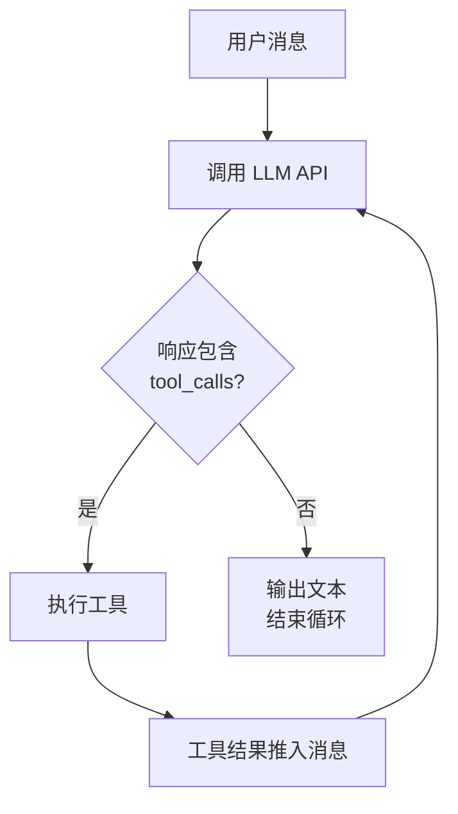
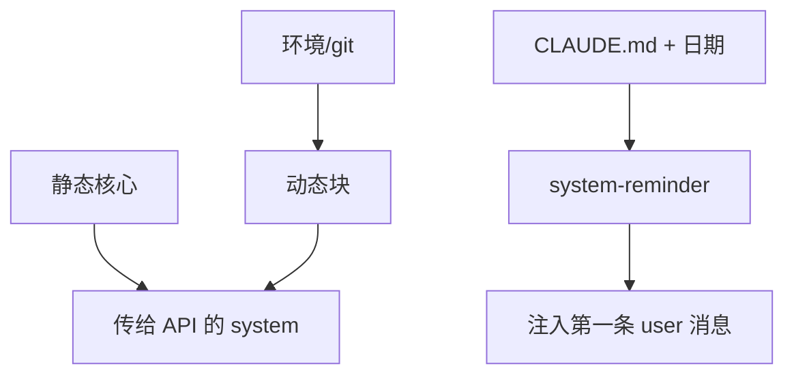
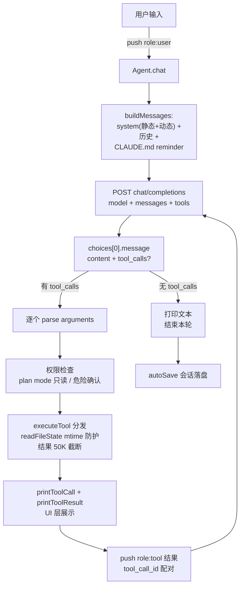

# 从零构建 Coding Agent（上）：核心骨架与会话系统

> 把前 3 单元学的机制，拼成一个真实可跑的 Coding Agent。
> 主线：`claude-code-from-scratch` 教程 ch1-4（本地已克隆）。
> 本笔记对应实现：`src/` 文件夹（JS + OpenAI 兼容格式，DeepSeek 可跑）。

## Agent Loop（ch1）—— 心脏

一个循环：**调模型 → 看它要不要用工具 → 用完把结果喂回去 → 再调模型**，直到模型不再要工具。



**决定循环转不转的，从头到尾是模型，不是我们的代码。** 我们没写任何"如果是读文件请求就……"的分支——这是 agent 和聊天机器人的分界线。

消息数组就是全部记忆。带工具的那几轮，数组通常多两条：

```
第 1 轮:  [user] → [assistant(text+tool_use)] → [user(tool_result)]
第 2 轮:  ... → [assistant(text+tool_use)] → [user(tool_result)]
第 3 轮:  ... → [assistant(text)]   ← 无 tool_calls → break
```

对应代码 `src/agent.mjs` 的 `chat()`：`messages.push(reply)` → `if (toolCalls.length === 0) return` → 执行 → `push(...results)`。

## 工具系统（ch2）

一个工具三样东西：**名字、给模型看的说明（schema）、干活的函数**。定义 = 静态数组（直接是 API 的 tools 参数），执行 = 一个分发器（switch）。

核心工具：`read_file` / `write_file` / `edit_file` / `list_files` / `grep_search` / `run_shell` / `web_fetch` / `tool_search`。

### edit_file 的两个坑（ch2 的重点）

1. **唯一匹配**：`old_string` 出现 0 次 = 模型的记忆过期了（幻觉检测），出现 >1 次 = 定位有歧义——**宁可失败也不猜**，静默替换第一个匹配远比告知失败危险。
2. **引号容错**：LLM 的 tokenization 可能把直引号映射成弯引号（`"` → `"`），不做容错这类编辑 100% 失败。匹配成功后返回**文件中的原始字符串**，保持文件原始风格。
3. **read-before-edit + mtime 防护**：编辑/写入已存在的文件前必须先 `read_file`（记录 mtime），读后 mtime 变了说明文件被外部修改 → 拒绝而不是静默覆盖。`readFileState: Map<absPath, mtimeMs>` 就是凭证。
4. **50K 结果截断**：保留头尾（很多命令的关键输出在末尾），截断提示让模型决定要不要用 grep/read 取完整。

### deferred 工具 + tool_search（懒加载）

工具多了全发 schema 浪费 token。deferred 工具（`enter_plan_mode` / `exit_plan_mode`）冷启动不载入，模型需要时调 `tool_search` 激活。激活状态只增不改 → 工具数组字节确定性（s07/s15 的"前缀即资产"）。

## System Prompt（ch3）

拆成两半：

|                    | 内容                                                       | 特点                        |
| ------------------ | ---------------------------------------------------------- | --------------------------- |
| **静态核心** | 身份、规则、工具偏好（"不要扩大范围/防御性编程/过早抽象"） | 跨会话逐字不变 → 能被缓存  |
| **动态块**   | 工作目录、平台、shell、Git 状态                            | 会话内稳定但因机器/项目而异 |



CLAUDE.md 项目指令：从 CWD **向上遍历**找（子目录规则优先级高）+ `@include` 解析（`@./x` / `@~/x` / `@/x`，防循环引用）+ `.claude/rules/*.md` 自动加载。CLAUDE.md + 当前日期包成 `<system-reminder>` 追加，不污染静态核心（这样改 CLAUDE.md 不会让静态前缀缓存失效）。

反模式接种：明确告诉模型"**不要做什么**"，比只描述"要做什么"有效——正面指令给模型留了自我合理化的空间。

## CLI 与会话（ch4）

- **参数解析**：`--plan`（只读）/ `--yolo` / `--accept-edits` / `--model` / `--api-base` / `--resume` / `--max-turns`。手写循环而不用库，因为参数少、零依赖。
- **两种模式**：有 prompt → 单次执行退出；无 → REPL。
- **REPL 命令**：`/clear` `/cost` `/compact` `/plan`。
- **Ctrl+C 双重语义**：处理中 → 中断当前轮（`agent.abort()` → AbortController 掐断网络请求）；空闲 → 第一次提醒、第二次退出。避免两种意外：手滑退出丢会话、agent 跑偏只能干等。
- **`rl.once` 而非 `rl.on`**：保证严格串行——`rl.on` 会在 `await agent.chat()` 没完成时就响应下一行，多个 chat 并发修改消息历史。
- **会话持久化**：会话 = 消息数组，存 JSON（ch4 最小形态；真实产品用 JSONL 追加式，见 s08）。每次 chat 后自动保存，失败静默忽略。

## 协议说明：Anthropic ↔ OpenAI（本仓库做了什么翻译）

教程原版是 **Anthropic Messages API**，本仓库翻译成 **OpenAI 兼容**（DeepSeek 能直接跑）。对应关系：

| Anthropic                                             | OpenAI（本仓库）                                            | 说明                                 |
| ----------------------------------------------------- | ----------------------------------------------------------- | ------------------------------------ |
| `client.messages.create({system, messages, tools})` | `POST /chat/completions`                                  | 端点不同                             |
| system 参数                                           | `messages` 里 `role:"system"`                           | OpenAI 无独立 system 参数            |
| content 是 block 数组（`text` / `tool_use`）      | `content` 字符串 + 独立的 `tool_calls` 数组             | OpenAI 拆成两个字段                  |
| `tool_use` block（id + name + input）               | `tool_calls[]`（id + function.name + function.arguments） | arguments 是 JSON 字符串，要先 parse |
| `tool_result`（`tool_use_id` 认回调用）           | `role:"tool"` 消息（`tool_call_id` 认回）               | 配对协议                             |
| tools 用`input_schema`                              | tools 用`function.parameters`                             | schema 键名不同                      |

**核心概念没变**：都是"assistant 带着调用请求 → 执行 → 结果按 id 回填 → 再调模型"。换协议只是换字段名。

## 完整执行流程图



## 每个环节的输入输出

| 环节     | 输入 → 输出                                                               |
| -------- | -------------------------------------------------------------------------- |
| 调模型   | 完整消息数组 + system + tools → assistant 消息（文本 或 文本+tool_calls） |
| 判断继续 | assistant 是否带 tool_calls → 有则执行工具，无则结束                      |
| 执行工具 | tool_call 的 name + arguments(JSON 字符串) → 工具结果字符串               |
| 回填     | tool_call_id + 结果 → 一条 role:"tool" 消息推进历史                       |
| 再调模型 | 变长的消息数组 → 下一轮 assistant 回复                                    |

## 运行

```powershell
cd .\04-构建CodingAgent核心
$env:AGENT_API_KEY = "sk-xxx"
node src\cli.mjs --mock "Read greeting.txt and tell me what it says."   # 免 key 自测
node src\cli.mjs "把 src/tools.mjs 的前 20 行读给我看"                    # 单次模式
node src\cli.mjs                                                        # REPL
node src\cli.mjs --resume                                               # 恢复会话
```

详细说明见 `src/README.md`。


coding agent 大成功\^_^
