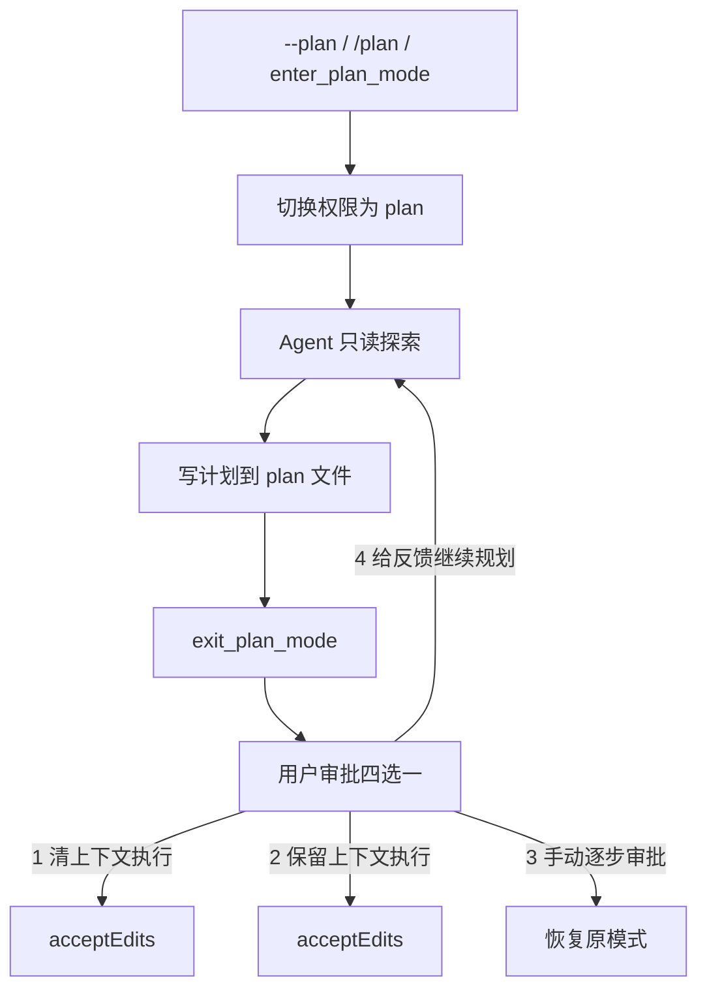
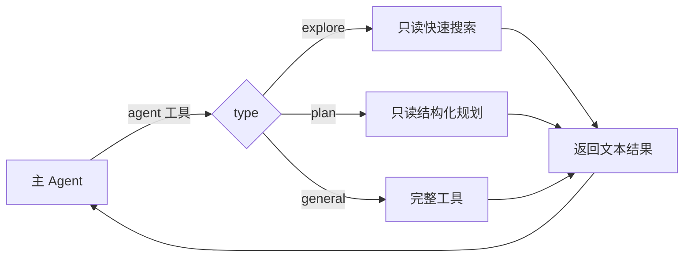

# 从零构建 Coding Agent（下）：Plan Mode、多 Agent 与工程化测试

> 单 Agent 收尾 + 工程化收口：Plan Mode、子 Agent、MCP、可测试性。
> 实现：`src/`（JS + OpenAI 兼容，DeepSeek 可跑）。

## Plan Mode（ch10）—— 先想清楚再做

问题：agent 越来越会动手，可有时候不想让它一上来就改代码，想先看它打算怎么干、批准了再动手。

**核心：只读靠权限系统代码级强制，不是提示词求它别乱动。**



几个关键设计：

1. **plan 文件白名单**：`checkPermission` 接收 `planFilePath`，plan 模式下唯一可写的文件就是它——系统提示说"只能写 plan 文件"不是建议，是**代码强制**。
2. **`prePlanMode` 记住进入前的模式**：退出时精确恢复（进之前是 acceptEdits，退出还是 acceptEdits，不是 default）。
3. **`Do NOT ask the user to approve`**：没有这句，模型写完计划会问"可以吗"而不是调 `exit_plan_mode`，审批流无法触发。
4. **审批是回调注入**（`planApprovalFn`）：Agent 类不依赖 UI——CLI 用 readline，测试可注入 mock，子 Agent 无审批函数直接退出。
5. **clear-and-execute 切到 acceptEdits**：用户批准了，说明信任方向，别反复确认每次编辑。

## 子 Agent（ch11）—— 分而治之

问题：一个大任务全塞进一个 agent，上下文很快就满了。

**核心洞察：子 Agent 本质上就是一个配置不同的 Agent 实例。**



关键设计：

1. **explore/plan 只给三个只读工具（read_file/list_files/grep_search），连 shell 都不给**——从工具层面断掉跑破坏性命令的可能，比靠 prompt 提醒更稳。
2. **general 排除 `agent` 工具防无限递归**——A 建 B、B 建 C 会指数级烧 token。
3. **fork-return 为什么是最佳起点**：无共享状态（不可能污染主上下文）、控制流确定、容错简单（子 Agent 出错父 Agent 继续）。
4. **输出用 buffer 收集而非回调**：`outputBuffer` 三态（null=主 Agent 打印 / [] = 子 Agent 收集 / [...] 积累），只改 `emitText` 一处，`chat()` 完全不感知自己在哪个模式。
5. **权限继承的坑**：子 Agent 默认 `bypassPermissions`（主 Agent 已授权），但 **plan 模式必须继承**——否则子 Agent 能绕过只读限制，这是安全漏洞。
6. **自定义 Agent**（`.claude/agents/*.md`）：frontmatter 指定 allowed-tools，复用 parseFrontmatter。

## MCP（ch12）—— 动态挂载外部工具

在 03 已详细读过。这里回顾关键：

- **核心**：spawn 子进程 → JSON-RPC 握手（initialize → notifications/initialized → tools/list）→ 发现工具 → `mcp__server__tool` 前缀注册 → 透明路由。
- **对 Agent Loop 透明**：MCP 工具和内置工具没有区别，都是名字 + schema + 执行函数。
- **三段式前缀**：一个名字同时解决命名冲突 + 嵌入路由信息。
- **懒连接 + 失败不崩**：首次 chat 才连；一个服务器失败不影响其他。
- **和 03 的连接**：03 用命令行的方式注册到 Claude Code；这里是在 agent 内部直接实现 MCP 客户端，接进来的是**你自己的 agent**。

## 测试（ch14）—— 可测试性收口

Coding Agent 的测试和普通软件不同：**核心行为取决于 LLM 的响应，输出不确定**。所以分两层：

| 层 | 覆盖 | 方式 |
|---|---|---|
| 自动化单元测试 | 确定性部分：权限/工具/技能/记忆/子Agent配置/上下文 | `node test\unit-tests.mjs`（26 项，免 key） |
| 手动验收清单 | 真实模型判断 + 交互手感：MCP/流式/记忆/plan/子Agent | `test/checklist.md`（22 项） |

两层互补，不是替代。Claude Code 自己也用这套策略：核心工具有单元测试，Agent 行为靠人工 QA + eval 套件。

## 什么时候该拆多个 Agent？

| 信号 | 该拆 | 不该拆 |
|---|---|---|
| 上下文 | 主 Agent 上下文快满，任务可分解 | 任务小，一次循环能完成 |
| 隔离 | 子任务需要干净上下文、不想污染主对话 | 需要共享状态/全局视角 |
| 并行 | 多个独立探索/子任务可并行 | 有严格顺序依赖 |
| 容错 | 子 Agent 失败不应影响主流程 | 失败会导致不一致 |

**一句话**：子 Agent 的价值是"隔离 + 分治"，代价是"多一轮 API 往返 + 看不到中间过程"。小任务拆它纯属浪费（还得把上下文重新讲一遍给子 Agent）；大任务不拆会撑爆窗口。拆不拆，问自己一句：**这个子任务能不能独立成一件"只回结果"的事？** 能就拆，不能就留着。

## 运行

```powershell
cd .\06-多Agent与工程化
$env:AGENT_API_KEY = "sk-xxx"
node test\unit-tests.mjs                                  # 26 项自动化测试
node src\cli.mjs --yolo "用 agent 工具(type=explore)找 src/ 下 import memory 的文件"   # 子 Agent
node src\cli.mjs --yolo --plan "分析项目结构，写方案到 plan 文件"                         # Plan Mode
node src\cli.mjs --yolo                                    # REPL：/plan /cost /memory /技能名
```

详细说明见 `src/README.md`，手动验收见 `test/checklist.md`。


**26 项自动化单测（免 key）**：权限（危险检测/deny 优先/plan 白名单）、工具（read/edit/mtime/list/grep）、技能、frontmatter、子 Agent 配置、上下文持久化/压缩。

踩了一个**测试 bug**：`edit 多匹配拒绝` 偶发失败（25/26）——测试在外部 `writeFileSync` 改文件后**没重新 read**，于是触发的不是"唯一匹配"检查，而是 **mtime 防护**（"file was modified externally"）。补一次 `read_file` 刷新凭证后 26/26 全绿。

**测试要区分"你测的防护"和"别的防护"**


**子 Agent fork-return 实测**：主 Agent 派 `agent(type=explore)` 子 Agent，输出标记 `┌─ Sub-agent [explore]` / `└─ completed`。子 Agent 只用只读工具（list_files / grep_search / read_file），啃完把结果带回主对话——4 个 import `./memory.mjs` 的文件全部找出（agent/cli/prompt/tools）。

验证了 ch11 三个设计：explore 只读工具集、独立干净上下文、结果回填不灌中间过程。


**Plan Mode 实测暴露两个真实 bug（已修）**：

1. **`--plan` 启动没初始化 plan 文件**：CLI 直接设 `permissionMode = "plan"`，绕过了 `togglePlanMode`，所以 `planFilePath` 是 null、`prePlanMode` 是 null——模型拿到"plan 文件路径 null"，没法写 plan 文件。
2. **plan 模式把 write_file/edit_file 从工具列表过滤了**：`getActiveTools()` 在 plan 模式只返回只读工具，模型"看不见" write/edit → 只能疯狂 `tool_search`，但它们不是 deferred、搜也搜不到。

**修法**：`--plan` 启动时初始化 plan 状态（planFilePath + prePlanMode）；plan 模式**返回全部工具**，只读约束由权限闸强制——`写 plan 文件 → allow`、`写其他 → deny`、`shell → deny`。


**"让模型看不到" vs "让模型看得到但拦"**——plan 文件是唯一可写项，模型必须能看到并调用 write_file 才能写它；限制靠权限闸而不是藏工具。藏起来连 plan 文件都写不了，反而把合法路径也堵死了。


再次测试：


批准计划：


