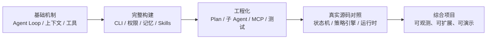

# 从零构建 Coding Agent：系列总目录与学习路线

本文记录了我从零理解并实现 Coding Agent 的完整过程。

> GitHub 仓库：[XVSHIFU/ai-agent-learning](https://github.com/XVSHIFU/ai-agent-learning)

一开始，我想弄清楚的只是一个看似简单的问题：普通聊天模型只能“一问一答”，为什么 Claude Code、Codex 这类 Coding Agent 却能自己读文件、修改代码、执行命令，并根据结果继续工作？

真正动手后才发现，Agent Loop 只是起点。一个能演示的循环并不难写，难的是让它在真实项目中可靠地运行：工具调用需要边界，长对话需要压缩，危险操作需要权限控制，任务需要规划和拆分，失败过程需要留下可追踪的记录。最终，这条学习路线从一个最小循环逐步扩展成了一个可以运行、测试和继续演进的 mini Claude Code（最终成品见[mini-claude-code](https://github.com/XVSHIFU/ai-agent-learning/tree/main/mini-claude-code)）。

下面是整个系列的文章目录，以及每一阶段解决的问题。

## 系列全景



整套内容分为四个阶段，共九篇文章：

| 阶段     | 文章                                                                                                                                                                                                                                                               | 对应仓库目录   | 核心问题                                 |
| -------- | ------------------------------------------------------------------------------------------------------------------------------------------------------------------------------------------------------------------------------------------------------------------ | -------------- | ---------------------------------------- |
| 基础机制 | [1]() / [2]() / [3]()              | `01`–`03` | Agent 为什么能行动，怎样管理上下文和工具 |
| 从零构建 | [4]() / [5]() / [6]() | `04`–`06` | 怎样把机制拼成一个可运行的 Coding Agent  |
| 源码对照 | [7]() / [8]()                                                                                              | `07`         | 教学原型与真实工程之间还差什么           |
| 综合项目 | [9]()                                                                                                                                                                            | `08`         | 怎样把前面的能力收口成一个完整作品       |

> **以下的内容为所有笔记的省流版，可以快速过一遍，需要完整内容可跳转到对应文章**

## 第一阶段：先理解 Agent 的三个底层机制

这一阶段不急着复制某个成熟产品，而是把 Agent 拆成三个最小问题：循环为什么能够持续、上下文怎样维持状态、工具怎样安全地连接外部世界。

### 1. [从零理解 AI Agent：主循环、工具系统与执行预算](/xvsf/posts/从零理解-ai-agent主循环工具系统与执行预算/)

从 Agent Loop 出发，对比普通 Chatbot 与 Agent 的区别，并实现“模型请求工具—程序执行工具—结果回填模型”的最小闭环。文章还给无限循环加上执行预算与纠偏机制，处理模型重复调用、原地空转和迟迟不结束的问题。

读完这一篇，应该能够用一句话解释 Agent 的核心：**模型负责决策，程序负责执行，工具结果进入上下文后驱动下一轮决策。**

### 2. [AI Agent 上下文工程：流式中断、压缩、缓存与持久化](/xvsf/posts/ai-agent-上下文工程流式中断压缩缓存与持久化/)

Agent 的状态并不藏在某个神秘变量里，而是主要存在于不断增长的消息历史中。这一篇讨论流式响应中断后的消息配对、长上下文压缩、Prompt 缓存命中条件，以及使用 JSONL 事件日志恢复会话。

它回答的是：当 Agent 连续工作几十轮，甚至进程退出后重新启动时，怎样保证它还记得发生过什么，同时又不让上下文无限膨胀。

### 3. [AI Agent 工具系统进阶：输出预算、渐进式披露与 MCP](/xvsf/posts/ai-agent-工具系统进阶输出预算渐进式披露与-mcp/)

工具不只是几个可以调用的函数。工具名称、参数定义、执行结果和错误信息，都是模型与程序之间的协议。这一篇从工具注册表讲到输出截断与落盘、工具按需发现，以及一个自己实现的只读文件搜索 MCP Server。

这一阶段结束后，Agent 的三个基本部件已经齐全：**循环、上下文和工具。**

## 第二阶段：从零搭出一个 Coding Agent

接下来不再单独研究机制，而是沿着一条可运行的代码主线逐章增加能力。三篇文章分别对应核心骨架、可靠性能力和工程化收口。

### 4. [从零构建 Coding Agent（上）：核心骨架与会话系统](/xvsf/posts/从零构建-coding-agent上核心骨架与会话系统/)

这一篇完成 Coding Agent 的第一版骨架：Agent Loop、文件与 Shell 工具、System Prompt、命令行入口和会话恢复。重点不在代码量，而在每一轮输入输出的协议，以及 `read-before-edit`、唯一匹配和文件修改时间检查这些可靠性约束。

到这里，程序已经可以接收自然语言任务，自主读取项目、修改文件并执行命令。

### 5. [从零构建 Coding Agent（中）：安全、记忆与 Skills](/xvsf/posts/从零构建-coding-agent中安全记忆与-skills/)

能执行命令之后，最先出现的不是“能力不够”，而是“边界不够”。这一篇加入流式响应、权限模式与 deny 规则、上下文压缩、跨会话记忆和 Skills 系统。

这一版开始区分“模型想做什么”和“程序允许它做什么”：模型可以提出工具调用，但真正执行前还要经过权限判断。Skills 也让固定知识和工作流不必全部塞进 System Prompt，而是可以按任务发现和加载。

### 6. [从零构建 Coding Agent（下）：Plan Mode、多 Agent 与工程化测试](/xvsf/posts/从零构建-coding-agent下plan-mode多-agent-与工程化测试/)

这一篇继续加入 Plan Mode、子 Agent、MCP 客户端和测试体系。Plan Mode 把“先调查和制定方案”与“真正修改项目”分开；子 Agent 通过独立上下文处理探索、规划等子任务；MCP 让外部工具可以动态挂载；单元测试和手动清单则为前面的能力建立回归边界。

完成这一阶段后，项目已经不再是单文件演示，而是一个具备 CLI、权限、上下文、记忆、Skills、Plan Mode、多 Agent、MCP 和测试的 mini Claude Code。

## 第三阶段：拿教学原型对照真实工程

自己实现一遍之后再读真实源码，关注点会从“这段代码在做什么”变成“它为什么要复杂到这个程度”。这一阶段没有继续盲目增加功能，而是专门寻找教学实现与生产级 Agent Harness 之间的差距。

### 7. [Coding Agent 架构对照：从教学原型到真实工程](/xvsf/posts/coding-agent-架构对照从教学原型到真实工程/)

这篇先做横向比较：将自己实现的 mini Claude Code 与社区版 Claude Code、pi 等项目放在一起，对照 Agent Loop、工具抽象、权限、上下文和子 Agent 的设计。

对照的目的不是追求更多代码，而是区分两类复杂度：一类是教学阶段可以省略的产品复杂度，另一类是随着任务规模扩大迟早必须补上的结构，例如工具生命周期、声明式策略、错误恢复和可观测性。

### 8. [Claude Code v2.1.88 源码解析：Agent、工具、权限与上下文](/xvsf/posts/claude-code-v2.1.88-源码解析agent工具权限与上下文/)

这篇进一步进入 Claude Code v2.1.88 泄露 source map 的社区还原源码，追踪真实实现中的状态机、Tool 运行协议、并发调度、权限策略、上下文边界、Skills、子 Agent 和插件机制。

它最重要的结论不是“真实源码更复杂”，而是：最初学习的核心循环并没有消失，只是被拆进了更明确的状态、协议和边界中。生产级实现的大部分代码，都在处理循环周围那些失败时才会暴露的问题。

## 第四阶段：综合项目收口

### 9. [Mini Claude Code 实战：权限、Skills、可观测性与多 Agent](/xvsf/posts/mini-claude-code-实战权限skills可观测性与多-agent/)

最后一篇回到自己的代码，在前面版本的基础上完成综合项目。主要改进包括声明式权限规则、Skills 懒加载、本地 JSONL Trace、多 Agent 调用与测试，并通过一个离线任务看板展示 Agent 读取项目、规划任务、修改代码和验证结果的完整过程。

这一阶段的目标不再是“再实现一个功能”，而是把已有能力组织成别人能够看懂、运行和验证的作品：代码有明确入口，关键设计有 ADR，执行过程可以追踪，核心行为有测试兜底。

## 说明：这套项目最终实现了什么

如果把文章中的所有机制合在一起，一个 Coding Agent 的运行过程可以概括为：

```text
用户任务
  ↓
构造 System Prompt、项目环境和历史消息
  ↓
LLM 生成文本回复或 Tool Call
  ↓
权限系统判断工具能否执行
  ↓
工具读取文件、修改代码或运行命令
  ↓
结果写回消息历史，并记录 Trace
  ↓
上下文压缩、记忆召回、循环预算与错误恢复
  ↓
进入下一轮，直到任务完成或被安全终止
```

从代码结构上看，它不是一个无所不能的“智能对象”，而是几层职责清楚的系统：

| 层次   | 负责什么                       | 典型机制                                 |
| ------ | ------------------------------ | ---------------------------------------- |
| 决策层 | 根据当前上下文决定下一步       | LLM、System Prompt、Agent Loop           |
| 执行层 | 把模型意图变成外部动作         | 文件工具、Shell、MCP、子 Agent           |
| 控制层 | 决定动作是否允许、循环是否继续 | 权限、Plan Mode、执行预算、拒绝规则      |
| 状态层 | 保存短期与长期信息             | 消息历史、压缩、缓存、Memory、JSONL 会话 |
| 工程层 | 让行为可检查、可扩展、可回归   | Skills、Trace、测试、ADR、CLI            |

这也是整个系列最想说明的一件事：**Coding Agent 的能力来自模型，但可靠性来自模型之外的工程系统。**模型负责理解任务和选择动作，程序必须负责权限边界、状态维护、工具协议、失败处理和结果验证。只把一个强模型接上 Shell，并不会自动得到一个可靠的 Coding Agent。

## 推荐阅读方式

如果第一次接触 Agent，建议按 1–9 的顺序阅读。前三篇建立机制直觉，中间三篇把机制落到代码，源码对照解释真实产品为何更复杂，最后用综合项目完成收口。

如果已经写过 Agent，可以按问题选读：

- 想理解 Agent Loop 和工具调用：读[第 1 篇]()、[第 4 篇]()。
- 遇到长对话、缓存或会话恢复问题：读[第 2 篇]()、[第 5 篇]()。
- 正在设计工具、MCP 或 Skills：读[第 3 篇]()、[第 5 篇]()、[第 6 篇]()。
- 关心权限、Plan Mode 和多 Agent：读[第 5 篇]()、[第 6 篇]()、[第 9 篇]()。
- 想从教学 Demo 走向生产级架构：读[第 7 篇]()、[第 8 篇]()、[第 9 篇]()。

系列正文到综合项目为止已经形成闭环，但项目本身仍然可以继续演进。后续无论增加更强的错误自修复、更细的权限语义，还是更成熟的任务调度，都可以回到同一条主线判断：它究竟是在增强决策、执行、控制、状态，还是工程保障。

这比继续堆功能更重要。只有知道一个机制属于哪一层、解决什么失败模式，Agent 才会从“能跑的演示”逐渐变成“可以信任的工具”。

## 参考文章与项目

这个系列不是从单一教程出来的。前 03 个单元主要参考机制型教程，04–06 沿完整构建教程推进，07 再用真实工程和源码材料做对照，08 则回到自己的实现完成综合项目。

下面按它们在学习路线中的作用分类。GitHub 项目尽量链接到本次学习实际使用的固定提交，避免仓库后续更新导致文章内容与参考版本错位。

### 入门课程与体系资料

- [AI Agent 架构：从单体 Agent 到企业级多智能体](https://waylandz.com/ai-agent-book/%E5%89%8D%E8%A8%80/)：用于建立 Agent、工具、记忆和多 Agent 的整体视角。
- [Hello-Agents](https://hello-agents.datawhale.cc/#/)：Datawhale 的中文 Agent 教程，适合入门和概念查漏。
- [《深入理解 AI Agent》在线版](https://bojieli.github.io/ai-agent-book/book/chapter1/)：用于查询 Agent 基础概念和不同能力模块。
- [AI Agents 从零开始](https://didilili.github.io/ai-agents-from-zero/#/)：从基础原理到实现的中文学习材料。
- [AI Agent 开发项目实战](https://liwenzhou.com/courses/ai-agent/)：用于对照工程化 Agent 项目的组织方式。

### 本系列的两条主线

- [learn-agent（本次使用版本）](https://github.com/7-e1even/learn-agent/tree/02dc380a82da9c3900d58631b4295738ebb8ce04)：01–03 的主要机制来源。每个主题用小型、零依赖 Demo 拆解 Agent Loop、上下文、工具、缓存、持久化和渐进式披露。
- [Claude Code from Scratch（本次使用版本）](https://github.com/Windy3f3f3f3f3f/claude-code-from-scratch/tree/0b452360866433fde0dc77cd37ada9d303546592)：04–06 的构建主线，用逐章演进的方式实现 Agent Loop、CLI、权限、Skills、Plan Mode、子 Agent、MCP 和测试。
- [《深入理解 AI Agent》源码仓库（本次使用版本）](https://github.com/bojieli/ai-agent-book/tree/2ecc877f4750d255e43a3433dd7b99f882d3f843)：与在线版配套的代码和案例，本系列将它作为概念字典和扩展参考，而不是逐章照读的主线。

### 真实 Coding Agent 工程对照

- [claude-code-best/claude-code（本次使用版本）](https://github.com/claude-code-best/claude-code/tree/d010f7727474824c54809d08b69c65cd6133872f)：社区版 Claude Code，实现规模远大于教学原型，用于对照工具抽象、权限、上下文和产品工程。
- [pi（本次使用版本）](https://github.com/earendil-works/pi/tree/b7bb00b936dbe21b8e160b3e89efdec361846699)：用于观察小核心、扩展边界和 Agent 工具包的模块设计。
- [Reina](https://github.com/Reina-Agent/Reina)：桌面 Coding Agent 项目，01 的 Agent Loop 和工具注册表部分曾用它做真实产品对照。

### MCP 协议资料

- [Model Context Protocol 官方站点](https://modelcontextprotocol.io/)：MCP 的概念、架构和使用文档。
- [Model Context Protocol Specification](https://github.com/modelcontextprotocol/specification)：协议规范与版本记录。03 和 06 中的 MCP Server、客户端握手、工具发现与调用结构均以协议语义为基础。

### Claude Code v2.1.88 源码溯源与备份

以下材料主要服务[第 8 篇文章]()。这里的研究对象应称为“Claude Code v2.1.88 泄露 source map 的社区还原版”，不能等同于 Anthropic 内部 Git 仓库的完整镜像。

- [Zscaler：Anthropic Claude Code Leak](https://www.zscaler.com/blogs/security-research/anthropic-claude-code-leak)：公开事件与 source map 暴露情况的安全研究说明。
- [sanbuphy/learn-coding-agent](https://github.com/sanbuphy/learn-coding-agent)：本次溯源使用的原始事件入口，后续主分支内容发生过替换。
- [willin/claude-code-source-code](https://github.com/willin/claude-code-source-code)：保留早期源码对象和提交历史的 fork。
- [Icon-T/claude-code-source-code](https://github.com/Icon-T/claude-code-source-code)：本地 1,952 个文件完整性核验的主要对照仓库。
- [ZluxYao/claude-code-hub](https://github.com/ZluxYao/claude-code-hub)：保存发布包、source map 和还原源码的独立备份。
- [chauncygu/collection-claude-code-source-code](https://github.com/chauncygu/collection-claude-code-source-code)：Claude Code 历史源码材料的补充索引。

### 本系列代码

- [XVSHIFU/ai-agent-learning](https://github.com/XVSHIFU/ai-agent-learning)：本系列 01–08 的笔记、逐代实现、测试、源码对照记录和最终 Mini Claude Code 综合项目。

以上链接最后整理于 2026-08-26。教程和项目仍会持续更新...
