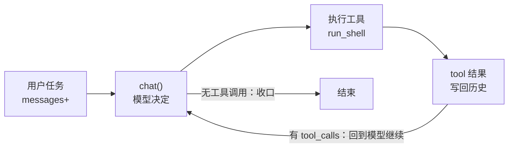

# 从零理解 AI Agent：主循环、工具系统与执行预算

> **Agent = LLM + 上下文 + 工具**

## Agent 主循环

### Chatbot：一问一答


### Agent：模型决定是否要执行工具，负责执行工具并喂回结果



### 实现：

定义一个会调用工具的 AI Agent：

`agent.mjs`

```js
#!/usr/bin/env node 
// 01-v0-Agent 循环
// AGENT_API_KEY=sk-xxx node agent.mjs                       # 默认 DeepSeek
// AGENT_BASE_URL=https://api.moonshot.cn/v1 AGENT_MODEL=kimi-k2-0711-preview ... # 更换不同厂商模型
// AGENT_BASE_URL=http://localhost:11434/v1  AGENT_MODEL=qwen3 ...   # 本地 Ollama

// ===========================================================================
// 学习笔记
//   const —— 常量，赋值后不可再改。声明变量尽量用它，要改就换 let。
//   模板字符串 `` —— 能跨行、能用 ${...} 插值。
//   stdout / stderr —— 标准输出 / 标准错误：正常结果走 stdout，报错信息走 stderr
//   ?? —— 空值合并：左边是 null/undefined 时取右边，否则取左边（比 || 更精确）
// ===========================================================================

import readline from "node:readline/promises";
import { execSync } from "node:child_process";

// 配置：从环境变量读，?? 表示“没设置就用默认值”。API_KEY 必填，不填直接退出。
const BASE_URL = process.env.AGENT_BASE_URL ?? "https://api.deepseek.com/v1";
const API_KEY = process.env.AGENT_API_KEY;
const MODEL = process.env.AGENT_MODEL ?? "deepseek-v4-flash";

if (!API_KEY) {
    console.error("缺少 AGENT_API_KEY。任何 OpenAI 兼容的 key 都行（DeepSeek / Kimi / GLM / OpenRouter / 本地 Ollama）。");
    process.exit(1);
}

// ---------------------------------------------------------------------------
// 1. 工具定义
//    "Bash is all you need"：能跑 shell，就能读文件、写文件、查环境、跑测试。
// ---------------------------------------------------------------------------

// 系统提示词（system prompt）：给 AI 的说明书——你是谁、有什么工具、怎么做事。
// 反引号是模板字符串：能跨行、能用 ${...} 插值（这里填了当前目录和操作系统名）。
const SYSTEM = `你是一个运行在用户终端里的编程助手。
你有一个工具 run_shell，可以在用户的机器上执行 shell 命令。
需要了解环境、读文件、改文件时，先用工具去看真实世界，不要凭空猜测。
当前目录：${process.cwd()}
操作系统：${process.platform}`;

// 工具清单（OpenAI 兼容格式）：告诉 AI 有哪些函数能调、怎么传参。
// name 工具名/ description 用途/ parameters 参数结构  （这里要求必传 command 字符串）。
const TOOLS = [
    {
        type: "function",
        function: {
            name: "run_shell",
            description: "在用户的终端里执行一条 shell 命令，返回 stdout 和 stderr。",  
            parameters: {
                type: "object",
                properties: {
                    command: { type: "string", description: "要执行的命令" },
                },
                required: ["command"],
            },
        },
    },
];

// TOOLS 只是"告诉 AI 有这个工具"，runShell 才是真正执行它的函数，两者靠名字配对。
function runShell(command) {
    // 黄色打印命令
    console.log(`\x1b[33m  $ ${command}\x1b[0m`);
    try {
        // execSync 选项：30 秒超时、输出上限 1MB（防 AI 打印海量内容卡死）、
        // stdio 里 stdin 忽略、stdout/stderr 用管道接住
        const out = execSync(command, {
            encoding: "utf8",
            timeout: 30_000,
            maxBuffer: 1024 * 1024,
            stdio: ["ignore", "pipe", "pipe"],
        });
        return out.trim() || "(命令执行成功，无输出)";
    } catch (err) {
        // 关键原则：工具失败不是异常，是信息。把错误交还给模型，它会自己改道。
        return `命令失败（exit ${err.status ?? "?"}）：\n${err.stdout ?? ""}${err.stderr ?? err.message}`;
    }   
}

// ---------------------------------------------------------------------------
// 2. chat()：一次 API 调用。没有任何魔法，就是一个 POST。
// ---------------------------------------------------------------------------

async function chat(messages) {
    const res = await fetch(`${BASE_URL}/chat/completions`, {
        method: "POST",
        headers: {
            "Content-Type": "application/json",
            "Authorization": `Bearer ${API_KEY}`,
        },
        body: JSON.stringify({
            model: MODEL,   
            messages: [{ role: "system", content: SYSTEM }, ...messages],
            tools: TOOLS,
        }),
    });
    if (!res.ok) throw new Error(`API ${res.status}：${await res.text()}`);
    // choices[0].message 就是模型的回复；它可能带着 tool_calls（表示"我要调工具"）
    const data = await res.json();
    return data.choices[0].message;
}

// ---------------------------------------------------------------------------
// 3. runTurn()：整套笔记的灵魂。agent 和 chatbot 的全部区别就在这个 while 里 ——
//    模型说"我要用工具"，代码就执行并把结果喂回去，然后再问它一次；
//      模型说完话不再要工具，这一轮才结束，话筒交还给用户。
//    决定循环继续还是结束的关键是 message.tool_calls 是否存在。
// ---------------------------------------------------------------------------

async function runTurn(messages) {
    while (true) {
        const msg = await chat(messages);
        messages.push(msg);

        if (msg.content) console.log(`\n${msg.content}`);
        if (!msg.tool_calls?.length) return; // 模型不再要工具 => 这一轮结束

        // call.arguments 是一段 JSON 字符串，先解析成对象，才能取到 args.command
        for (const call of msg.tool_calls) {
            let args = {};
            try {
                args = JSON.parse(call.function.arguments || "{}");
            } catch {
                // 解析失败就当作空对象，交给模型自己处理
            }
            // 按名字分发到真正执行的函数；不认识的工具也返回提示，而不是让程序崩
            const output =
                call.function.name === "run_shell"
                    ? runShell(args.command ?? "")
                    : `未知工具：${call.function.name}`;
            // role: "tool" —— 把工具结果作为一条消息放回对话，模型下一轮就能看到
            messages.push({ role: "tool", tool_call_id: call.id, content: output });
        }
    }
}

// ---------------------------------------------------------------------------
// 4. 入口：一个最普通的 REPL。messages 数组就是 agent 的全部记忆。
// ---------------------------------------------------------------------------

// readline：在终端里一问一答。messages 数组承载全部对话历史，就是 agent 的"记忆"
const rl = readline.createInterface({ input: process.stdin, output: process.stdout });
const messages = [];

console.log(`v0 agent 已上线（${MODEL}）。它有一双手：run_shell。Ctrl+C 退出。`);

while (true) {
  const line = (await rl.question("\n你> ")).trim();
  if (!line) continue;
  messages.push({ role: "user", content: line });
  await runTurn(messages);
}
```

### 运行：

Bash:

```bash
AGENT_API_KEY=sk-xxx node .\agent.mjs
```

PowerShell:

```powershell
$env:AGENT_API_KEY = "sk-xxxxxxxxxxxxxxxx"
node .\agent.mjs
```


> 日志里模型反复说"输出因终端编码显示为乱码"。这不是模型的问题，是编码不匹配：
>
> - execSync 在 Windows 上默认用 cmd.exe 跑命令，cmd 输出中文时按 GBK（代码页 936）编码

### 添加第二个工具 `current_time`：

TOOLS 数组加一项：

```js
const TOOLS = [
    {
        type: "function",
        function: {
            name: "run_shell",
            description: "在用户的终端里执行一条 shell 命令，返回 stdout 和 stderr。",  
            parameters: {
                type: "object",
                properties: {
                    command: { type: "string", description: "要执行的命令" },
                },
                required: ["command"],
            },
        },
    },
    {
        type: "function",
        function: {
            name: "current_time",
            description: "获取当前时间，返回格式为 YYYY-MM-DD HH:mm:ss。",
            parameters: {
                type: "object",
                properties: {},
            },
        },
    }
];
```

实现函数：

```js
function currentTime() {
    // 返回当前时间字符串。toLocaleString 会按本地时区格式化
    return new Date().toLocaleString("zh-CN", { hour12: false, timeZone: "Asia/Shanghai" });
}
```

分发加一个分支（旧三元写法注释保留作对照）：

```js
let output;
            if (call.function.name === "run_shell") {
                output = runShell(args.command ?? "");
            } else if (call.function.name === "current_time") {
                output = currentTime();
            } else {
                output = `未知工具：${call.function.name}`;
            }
            // const output =
            //     call.function.name === "run_shell"
            //         ? runShell(args.command ?? "")
            //         : call.function.name === "current_time"
            //         ? currentTime()
            //         : `未知工具：${call.function.name}`;
            // role: "tool" —— 把工具结果作为一条消息放回对话，模型下一轮就能看到
```


### 与真实产品对照（延伸阅读）

- 这 120 行和 Claude Code 的主循环在结构上是同一个东西。真实产品多出来的几万行，都花在这个循环的周边：工具更多更可靠（s02）、不空转（s03）、上下文不爆（s04/s06）、便宜（s07）、断了能接上（s08）、能分身（s09）。循环本身从 s01 到最后一章不再修改。
- 桌面 agent [Reina](https://github.com/Reina-Agent/Reina) 的引擎（`runTurn`）也是这个循环。它的 system prompt 同样以当前目录 + 平台开头。

## 工具系统

### 问题

s01 的练习中：加一个工具，要同时改两个地方——给模型看的 TOOLS 声明数组，和真正干活的 if-else 执行分支。工具一多，两处早晚对不上

另一个问题出在改文件上：shell 理论上万能，但让模型拼 `sed -i 's/old/new/' file` 去改文件很不可靠——引号转义、正则特殊字符、跨平台差异（Windows 没有 sed）、多行文本，每一项都容易出错。

### 解决方案

解法是把工具收拢成一张**注册表**——说明和实现放在同一处，天然不会失配。这就是**单一事实来源**（single source of truth）：同一份信息只写在一个地方，其余都从它生成。从此加工具 = 加一个条目。真实产品都是这个形状——Claude Code、Codex、Reina，本质都是一张注册表。


改文件的可靠性问题，靠读、写、改文件的专用工具解决。**专用文件工具不是为了省事，是为了可靠。**

#### 工具注册表

注册表就是一个对象，每个工具一个条目：

```js
const REGISTRY = {
  run_shell: {
    description: "在用户的终端里执行一条 shell 命令……",
    parameters: { type: "object", properties: { command: {...} }, required: ["command"] },
    handler: ({ command }) => { ... },
  },
  read_file:  { description, parameters, handler },
  write_file: { description, parameters, handler },
  edit_file:  { description, parameters, handler },
};
```

给模型看的说明（description + parameters）和给机器执行的实现（handler）放在一起。API 需要的 TOOLS 数组不再手写，由注册表生成：

```js
const TOOLS = Object.entries(REGISTRY).map(([name, t]) => ({
  type: "function",
  function: { name, description: t.description, parameters: t.parameters },
}));
```

工具的调度也从 if-else 变成查表：

```js
function dispatch(call) {
  const tool = REGISTRY[call.function.name];
  if (!tool) return `未知工具：${call.function.name}`;
  let args;
  try { args = JSON.parse(call.function.arguments || "{}"); }
  catch (err) { return `工具参数不是合法 JSON：${err.message}`; }
  try { return tool.handler(args); }
  catch (err) { return `工具执行出错：${err.message}`; }
}
```

dispatch 把 s01 的"错误即信息"升级成了系统性约定：未知工具、坏参数、handler 抛异常，三条失败路径全部变成文本回给模型，任何一条都不打死进程。

主循环唯一的变化是把 if-else 换成 `dispatch(call)`，之后不再修改。

#### read_file55：带行号输出

```js
const CAP = 50_000;
const body = text.length > CAP ? text.slice(0, CAP) + `\n…(截断，共 ${text.length} 字符)` : text;
return body.split("\n").map((line, i) => `${String(i + 1).padStart(4)}\t${line}`).join("\n");
```

带行号是为了模型能精确引用位置。那个 5 万字符的硬截断是个临时方案：如果文件有 2MB，截掉的部分模型永远看不到，它也不知道自己错过了什么。s04 会正面解决这个问题。

#### edit_file：唯一匹配规则

```js
handler: ({ path: p, old_string, new_string }) => {
  const text = readFileSync(p, "utf8");
  const first = text.indexOf(old_string);
  if (first === -1)
    return `编辑失败：old_string 在 ${p} 中找不到。请先 read_file 确认原文。`;
  if (text.indexOf(old_string, first + 1) !== -1)
    return `编辑失败：old_string 在 ${p} 中出现多次。请带上更多上下文让它唯一。`;
  // 不能用 text.replace(old, new)：new_string 里的 $$ / $& 会被 JS 当替换模式展开，静默写坏文件。
  writeFileSync(p, text.slice(0, first) + new_string + text.slice(first + old_string.length));
  return `已编辑 ${p}`;
},
```

`edit_file` 的规则：**old_string 必须在文件中出现且仅出现一次**，否则拒绝执行。这条规则把"模型脑中的文件"和"磁盘上的文件"强制对齐：

- 匹配不到 → 模型的记忆过期了（文件被改过，或它记错了）→ 报错引导它先 `read_file` 刷新认知，而不是改错地方；
- 匹配到多处 → 定位有歧义 → 报错引导它带上更多上下文行，精确到唯一。

再看两条报错文案："请先 read_file 确认原文"、"请带上更多上下文让它唯一"。报错是写给模型看的界面：好的报错直接告诉模型下一步动作，模型照做就能自愈；坏的报错（"Error: -1"）只会让它原地打转。

### 实现：

```js
#!/usr/bin/env node 
// 01-v1-工具系统
// - 
// AGENT_API_KEY=sk-xxx node agent.mjs                       # 默认 DeepSeek
// AGENT_BASE_URL=https://api.moonshot.cn/v1 AGENT_MODEL=kimi-k2-0711-preview ... # 更换不同厂商模型
// AGENT_BASE_URL=http://localhost:11434/v1  AGENT_MODEL=qwen3 ...   # 本地 Ollama

// ===========================================================================
// 学习笔记
//   const —— 常量，赋值后不可再改。声明变量尽量用它，要改就换 let。
//   模板字符串 `` —— 能跨行、能用 ${...} 插值。
//   stdout / stderr —— 标准输出 / 标准错误：正常结果走 stdout，报错信息走 stderr
//   ?? —— 空值合并：左边是 null/undefined 时取右边，否则取左边（比 || 更精确）
// ===========================================================================

import readline from "node:readline/promises";
import { execSync } from "node:child_process";
import { readFileSync, writeFileSync, mkdirSync } from "node:fs";
import path from "node:path";

// 配置：从环境变量读，?? 表示“没设置就用默认值”。API_KEY 必填，不填直接退出。
const BASE_URL = process.env.AGENT_BASE_URL ?? "https://api.deepseek.com/v1";
const API_KEY = process.env.AGENT_API_KEY;
const MODEL = process.env.AGENT_MODEL ?? "deepseek-v4-flash";

if (!API_KEY) {
    console.error("缺少 AGENT_API_KEY。任何 OpenAI 兼容的 key 都行（DeepSeek / Kimi / GLM / OpenRouter / 本地 Ollama）。");
    process.exit(1);
}

const SYSTEM = `你是一个运行在用户终端里的编程助手。
你有一个工具 run_shell，可以在用户的机器上执行 shell 命令。
需要了解环境、读文件、改文件时，先用工具去看真实世界，不要凭空猜测。
当前目录：${process.cwd()}
操作系统：${process.platform}`;

// ---------------------------------------------------------------------------
// 工具注册表： v1 的核心。每个工具 = 描述（给模型看）+ 参数 schema + handler。
// 主循环只认识这张表，永远不需要知道具体有哪些工具 —— 这就是"开闭"的最小形态。
// ---------------------------------------------------------------------------

const REGISTRY = {
    run_shell: {
        description: "在用户的终端里执行一条 shell 命令，返回 stdout 和 stderr。",
        parameters: {
            type: "object",
            properties: { command: { type: "string", description: "要执行的命令" } },
            required: ["command"],
        },
        handler: ({ command }) => {
            console.log(`\x1b[33m  $ ${command}\x1b[0m`);
            try {
                const out = execSync(command, {
                    encoding: "utf8",
                    timeout: 30_000,
                    maxBuffer: 1024 * 1024,
                    stdio: ["ignore", "pipe", "pipe"],
                });
                return out.trim() || "(命令执行成功，无输出)";
            } catch (err) {
                return `命令失败（exit ${err.status ?? "?"}）：\n${err.stdout ?? ""}${err.stderr ?? err.message}`;
            }
        },
    },

    read_file: {
        description: "读取一个文本文件，返回带行号的内容。",
        parameters: {
            type: "object",
            properties: { path: { type: "string", description: "文件路径（相对或绝对）" } },
            required: ["path"],
        },
        handler: ({ path: p }) => {
            console.log(`\x1b[33m  read ${p}\x1b[0m`);
            const text = readFileSync(p, { encoding: "utf8" });

            const CAP = 50_000;
            const body = text.length > CAP ? text.slice(0, CAP) + "\n...(内容过长被截断)..." : text;
            return body
                .split("\n")
                .map((line, i) => `${i + 1}`.padStart(4) + " | " + line)
                .join("\n");
        },
    },

    write_file: {
        description: "写入一个文本文件，覆盖原内容。父目录不存在时自动创建。",
        parameters: {
            type: "object",
            properties: {
                path: { type: "string", description: "文件路径（相对或绝对）" },
                content: { type: "string", description: "要写入的内容" }
            },
            required: ["path", "content"],
        },
        handler: ({ path: p, content }) => {
            console.log(`\x1b[33m  write ${p}\x1b[0m`);
            mkdirSync(path.dirname(path.resolve(p)), { recursive: true });
            writeFileSync(p, content);
            return `已写入 ${p}（${content.length} 字符）`;
        },
    },

    edit_file: {
    description:
      "对文件做一次精确替换。old_string 必须在文件中出现且仅出现一次（带上足够的上下文来保证唯一），否则会失败。",
    parameters: {
      type: "object",
      properties: {
        path: { type: "string", description: "文件路径" },
        old_string: { type: "string", description: "要被替换的原文（必须唯一匹配）" },
        new_string: { type: "string", description: "替换成的新文本" },
      },
      required: ["path", "old_string", "new_string"],
    },
    handler: ({ path: p, old_string, new_string }) => {
      console.log(`\x1b[33m  edit ${p}\x1b[0m`);
      const text = readFileSync(p, "utf8");
      const first = text.indexOf(old_string);
      if (first === -1) return `编辑失败：old_string 在 ${p} 中找不到。请先 read_file 确认原文。`;
      if (text.indexOf(old_string, first + 1) !== -1)
        return `编辑失败：old_string 在 ${p} 中出现多次。请带上更多上下文让它唯一。`;
      // 不能用 text.replace(old, new)：new_string 里的 $$ / $& 会被 JS 当替换模式展开，静默写坏文件。
      writeFileSync(p, text.slice(0, first) + new_string + text.slice(first + old_string.length));
      return `已编辑 ${p}`;
    },
  },
};

// 由注册表自动生成 API 所需的 tools 参数 —— 单一事实来源。
const TOOLS = Object.entries(REGISTRY).map(([name, { description, parameters }]) => ({
    type: "function",
    function: { name, description: t.description, parameters: t.parameters },
}));

// 统一调度：找不到工具、参数解析失败、handler 抛异常，都返回一个字符串给模型，让它自己处理，而不是让程序崩溃。
function dispatch(call) {
    const tool = REGISTRY[call.function.name];
    if (!tool) return `未知工具：${call.function.name}`;
    let args;
    try {
        args = JSON.parse(call.function.arguments || "{}");
    } catch (errr) {
        return `工具参数不是合法的 JSON：${err.message}`;
    }
    try {
        return tool.handler(args); 
    } catch (err) {
        return `工具执行失败：${err.message}`;
    }
}

// ---------------------------------------------------------------------------
// 主循环：同 v0（除了 dispatch 那一行）
// ---------------------------------------------------------------------------

async function chat(messages) {
    const res = await fetch(`${BASE_URL}/chat/completions`, {
        method: "POST",
        headers: {
            "Content-Type": "application/json",
            "Authorization": `Bearer ${API_KEY}`,
        },
        body: JSON.stringify({
            model: MODEL,   
            messages: [{ role: "system", content: SYSTEM }, ...messages],
            tools: TOOLS,
        }),
    });
    if (!res.ok) throw new Error(`API ${res.status}：${await res.text()}`);
    const data = await res.json();
    return data.choices[0].message;
}

async function runTurn(messages) {
    while (true) {
        const msg = await chat(messages);
        messages.push(msg);

        if (msg.content) console.log(`\n${msg.content}`);
        if (!msg.tool_calls?.length) return; 

        for (const call of msg.tool_calls) {
            messages.push({ role: "tool", tool_call_id: call.id, content: dispatch(call) });
        }
    }
}

const rl = readline.createInterface({ input: process.stdin, output: process.stdout });
const messages = [];

console.log(`v1 agent 已上线（${MODEL}）。工具：${Object.keys(REGISTRY).join("、 ")}。Ctrl+C 退出。`);

while (true) {
  const line = (await rl.question("\n你> ")).trim();
  if (!line) continue;
  messages.push({ role: "user", content: line });
  await runTurn(messages);
}


```

### 运行：

* 工具组合："在 demo/ 下建一个 hello.js 打印当前时间，然后把打印内容改成中文，最后跑给我看"


模型自己编排了三种工具。另外，模型可能在一条回复里同时发多个工具调用，s01 写的 for 循环已经支持。

* 触发唯一性检查：挑一个文件里出现多次的短语让它替换。观察 edit_file 报"出现多次"、模型带上更长的上下文重试成功——这是唯一匹配规则的现场演示。

> 这里为了确保 agent 使用 edit_file 工具，提示词中需要进行指定，否则模型会直接使用 powershell 的命令进行修改文件。

这里的关键现象是：`edit_file` 会先拒绝有歧义的短文本，模型随后补充更长的上下文并再次调用工具，从而完成唯一匹配的安全编辑。

### 练习：

加一个 list_dir 工具：列出目录内容，标注类型（文件/目录）和大小。

```js
import { readFileSync, writeFileSync, mkdirSync, readdirSync } from "node:fs";


...
list_dir: {
    description: "列出一个目录下的文件和子目录。",
    parameters: {
      type: "object",
        properties: { path: { type: "string", description: "目录路径（相对或绝对）" } },
        required: ["path"],
    },
    handler: ({ path: p }) => {
      console.log(`\x1b[33m  list ${p}\x1b[0m`);
      const entries = readdirSync(p, { withFileTypes: true });
      return entries
        .map((e) => (e.isDirectory() ? `[DIR]  ${e.name}` : `       ${e.name}`))
        .join("\n");
    },
  }
...
```


### 与真实产品对照（延伸阅读）

- Claude Code 的 Edit 工具与本章 `edit_file` 规则相同（还多一个 `replace_all` 参数处理"全部替换"的场景，留作思考题）。
- 为什么用字面量匹配而不用正则替换？因为正则转义是模型的常见出错点。字面量匹配 + 唯一性规则比正则可靠，这是各家产品从生产事故中得出的共同结论。
- Reina 的工具注册表在 `packages/tools/src/`，每个工具一个文件，形态和本章 REGISTRY 一致；它的 CLAUDE.md 里有一条规则："加新工具要注册进 tool registry，不许给引擎类加方法"——注册表一旦建立，就要守住它。
- CRLF 问题：Windows 文件是 `\r\n` 换行，模型给的 old_string 是 `\n`，会匹配不上。真实产品都遇到过。最简单的对策是让报错引导模型重试；更彻底的做法留作思考题。

## 循环预算与纠偏

给 s01 的`while(true)`循环装一个看门狗，处理“模型不喊停、循环就不停”的失控问题

### 问题

 agent 修一个测试：它跑一次，失败；改一行，再跑，又失败；然后把刚才那行改了回去，再跑……几十分钟过去，token 烧掉一大把，测试还是红的。s01 的循环是 `while (true)`，什么时候停完全由模型说了算——而模型每一轮都真诚地相信"下一次就能成"。

模型不喊停，循环就不停。从外部看，失控有三种典型模式：

| 失控模式 | 表现                                                 | 本质                       |
| -------- | ---------------------------------------------------- | -------------------------- |
| 复读机   | 一模一样的命令跑了 8 遍                              | 卡在同一个想法里出不来     |
| 连环报错 | 每一轮的工具全在报错，还在换着花样试                 | 撞墙了但没有意识到         |
| 原地踏步 | 动作不重复、也不报错，但全是读操作，世界没有任何变化 | 看起来在推进，实际没有进展 |

裸的 `while (true)` 对这三种情况没有任何防御。

### 解决方案

给循环装一个看门狗：记录每轮干了什么，发现空转先提醒模型换路，提醒无效再强制停下。

预算是软的——有进展就续期，但无论如何不能超过一个绝对上限。正常推进的 agent 不受惩罚，失控的 agent 也不会无限消耗——硬顶是最后的兜底。


### 实现：

#### v2-agent.mjs

```js
#!/usr/bin/env node 
// 01-v2-看门狗
// - 
// AGENT_API_KEY=sk-xxx node agent.mjs                       # 默认 DeepSeek
// AGENT_BASE_URL=https://api.moonshot.cn/v1 AGENT_MODEL=kimi-k2-0711-preview ... # 更换不同厂商模型
// AGENT_BASE_URL=http://localhost:11434/v1  AGENT_MODEL=qwen3 ...   # 本地 Ollama


import readline from "node:readline/promises";
import { execSync } from "node:child_process";
import { readFileSync, writeFileSync, mkdirSync, readdirSync } from "node:fs";
import path from "node:path";
import { LoopBudget, isRecoverable, repairPrompt } from "./loop-budget.mjs";

// 配置：从环境变量读，?? 表示“没设置就用默认值”。API_KEY 必填，不填直接退出。
const BASE_URL = process.env.AGENT_BASE_URL ?? "https://api.deepseek.com/v1";
const API_KEY = process.env.AGENT_API_KEY;
const MODEL = process.env.AGENT_MODEL ?? "deepseek-v4-flash";

if (!API_KEY) {
    console.error("缺少 AGENT_API_KEY。任何 OpenAI 兼容的 key 都行（DeepSeek / Kimi / GLM / OpenRouter / 本地 Ollama）。");
    process.exit(1);
}

const SYSTEM = `你是一个运行在用户终端里的编程助手。
你有一个工具 run_shell，可以在用户的机器上执行 shell 命令。
需要了解环境、读文件、改文件时，先用工具去看真实世界，不要凭空猜测。
当前目录：${process.cwd()}
操作系统：${process.platform}`;

// ---------------------------------------------------------------------------
// 工具注册表-同v1
// ---------------------------------------------------------------------------

const REGISTRY = {
    run_shell: {
        description: "在用户的终端里执行一条 shell 命令，返回 stdout 和 stderr。",
        parameters: {
            type: "object",
            properties: { command: { type: "string", description: "要执行的命令" } },
            required: ["command"],
        },
        handler: ({ command }) => {
            console.log(`\x1b[33m  $ ${command}\x1b[0m`);
            try {
                const out = execSync(command, {
                    encoding: "utf8",
                    timeout: 30_000,
                    maxBuffer: 1024 * 1024,
                    stdio: ["ignore", "pipe", "pipe"],
                });
                return out.trim() || "(命令执行成功，无输出)";
            } catch (err) {
                return `命令失败（exit ${err.status ?? "?"}）：\n${err.stdout ?? ""}${err.stderr ?? err.message}`;
            }
        },
    },

    read_file: {
        description: "读取一个文本文件，返回带行号的内容。",
        parameters: {
            type: "object",
            properties: { path: { type: "string", description: "文件路径（相对或绝对）" } },
            required: ["path"],
        },
        handler: ({ path: p }) => {
            console.log(`\x1b[33m  read ${p}\x1b[0m`);
            const text = readFileSync(p, { encoding: "utf8" });

            const CAP = 50_000;
            const body = text.length > CAP ? text.slice(0, CAP) + "\n...(内容过长被截断)..." : text;
            return body
                .split("\n")
                .map((line, i) => `${i + 1}`.padStart(4) + " | " + line)
                .join("\n");
        },
    },

    write_file: {
        description: "写入一个文本文件，覆盖原内容。父目录不存在时自动创建。",
        parameters: {
            type: "object",
            properties: {
                path: { type: "string", description: "文件路径（相对或绝对）" },
                content: { type: "string", description: "要写入的内容" }
            },
            required: ["path", "content"],
        },
        handler: ({ path: p, content }) => {
            console.log(`\x1b[33m  write ${p}\x1b[0m`);
            mkdirSync(path.dirname(path.resolve(p)), { recursive: true });
            writeFileSync(p, content);
            return `已写入 ${p}（${content.length} 字符）`;
        },
    },

    edit_file: {
    description:
      "对文件做一次精确替换。old_string 必须在文件中出现且仅出现一次（带上足够的上下文来保证唯一），否则会失败。",
    parameters: {
      type: "object",
      properties: {
        path: { type: "string", description: "文件路径" },
        old_string: { type: "string", description: "要被替换的原文（必须唯一匹配）" },
        new_string: { type: "string", description: "替换成的新文本" },
      },
      required: ["path", "old_string", "new_string"],
    },
    handler: ({ path: p, old_string, new_string }) => {
      console.log(`\x1b[33m  edit ${p}\x1b[0m`);
      const text = readFileSync(p, "utf8");
      const first = text.indexOf(old_string);
      if (first === -1) return `编辑失败：old_string 在 ${p} 中找不到。请先 read_file 确认原文。`;
      if (text.indexOf(old_string, first + 1) !== -1)
        return `编辑失败：old_string 在 ${p} 中出现多次。请带上更多上下文让它唯一。`;
      // 不能用 text.replace(old, new)：new_string 里的 $$ / $& 会被 JS 当替换模式展开，静默写坏文件。
      writeFileSync(p, text.slice(0, first) + new_string + text.slice(first + old_string.length));
      return `已编辑 ${p}`;
    },
  },

  list_dir: {
    description: "列出一个目录下的文件和子目录。",
    parameters: {
      type: "object",
        properties: { path: { type: "string", description: "目录路径（相对或绝对）" } },
        required: ["path"],
    },
    handler: ({ path: p }) => {
      console.log(`\x1b[33m  list ${p}\x1b[0m`);
      const entries = readdirSync(p, { withFileTypes: true });
      return entries
        .map((e) => (e.isDirectory() ? `[DIR]  ${e.name}` : `       ${e.name}`))
        .join("\n");
    },
  }
};

// 由注册表自动生成 API 所需的 tools 参数 —— 单一事实来源。
const TOOLS = Object.entries(REGISTRY).map(([name, t]) => ({
    type: "function",
    function: { name, description: t.description, parameters: t.parameters },
}));

// 简化版的成败判定：靠报错文案前缀识别失败。
// 真实产品（Reina 的 ToolCallRecord）会给每次调用带结构化的 status 字段 —— 这是玩具和产品的又一个分界线，s08 会把它落进持久化记录里。
const FAILURE_RE = /^(命令失败|编辑失败|工具执行出错|未知工具|工具参数)/;

// 统一调度：找不到工具、参数解析失败、handler 抛异常，都返回一个字符串给模型，让它自己处理，而不是让程序崩溃。
function dispatch(call) {
    const tool = REGISTRY[call.function.name];
    if (!tool) return `未知工具：${call.function.name}`;
    let args;
    try {
        args = JSON.parse(call.function.arguments || "{}");
    } catch (errr) {
        return `工具参数不是合法的 JSON：${err.message}`;
    }
    try {
        return tool.handler(args); 
    } catch (err) {
        return `工具执行失败：${err.message}`;
    }
}

// ---------------------------------------------------------------------------
// 主循环：同 v0（多了预算）
// ---------------------------------------------------------------------------

async function chat(messages) {
    const res = await fetch(`${BASE_URL}/chat/completions`, {
        method: "POST",
        headers: {
            "Content-Type": "application/json",
            "Authorization": `Bearer ${API_KEY}`,
        },
        body: JSON.stringify({
            model: MODEL,   
            messages: [{ role: "system", content: SYSTEM }, ...messages],
            tools: TOOLS,
        }),
    });
    if (!res.ok) throw new Error(`API ${res.status}：${await res.text()}`);
    const data = await res.json();
    return data.choices[0].message;
}

async function runTurn(messages) {
    // 预算：每轮最多 12 步工具调用，超过就停下来让模型自我纠偏或问用户。
    const budget = new LoopBudget({ baseSteps: 12 });
    let repaired = false; // 每轮用户消息只给一次纠偏机会

    while (true) {
        if (!budget.canContinue()) {
          const stop = budget.exhaustedStop();
          console.log(`\n\x1b[31m⛔ ${stop.message}（第 ${stop.turnCount} 轮）\x1b[0m`);
          return;
        }
  
        const msg = await chat(messages);
        messages.push(msg);
  
        if (msg.content) console.log(`\n${msg.content}`);
        if (!msg.tool_calls?.length) return;
  
        // 执行工具的同时，收集这一轮的行为记录喂给看门狗。
        const records = [];
        for (const call of msg.tool_calls) {
          const output = dispatch(call);
          messages.push({ role: "tool", tool_call_id: call.id, content: output });
          let input = {};
          try {
            input = JSON.parse(call.function.arguments || "{}");
          } catch { /* 坏参数已作为失败回填 */ }
          records.push({
            name: call.function.name,
            input,
            status: FAILURE_RE.test(output) ? "failed" : "completed",
            output,
          });
        }
  
        const stop = budget.recordTurn(records);
        if (!stop) continue;
  
        if (isRecoverable(stop) && !repaired) {
          // 熔断不是死刑：告诉模型它为什么被摁停，给它一次换路的机会。
          repaired = true;
          console.log(`\n\x1b[35m🟡 看门狗触发（${stop.reason}），注入纠偏 prompt…\x1b[0m`);
          messages.push({ role: "user", content: repairPrompt(stop) });
          continue;
        }
        console.log(`\n\x1b[31m⛔ ${stop.message}（reason=${stop.reason}，第 ${stop.turnCount} 轮）\x1b[0m`);
        return;
    }  
}  

const rl = readline.createInterface({ input: process.stdin, output: process.stdout });
const messages = [];

console.log(`v2 agent 已上线（${MODEL}）。工具：${Object.keys(REGISTRY).join("、 ")}。本轮预算 12 轮起、硬顶 48。Ctrl+C 退出。`);

while (true) {
  const line = (await rl.question("\n你> ")).trim();
  if (!line) continue;
  messages.push({ role: "user", content: line });
  await runTurn(messages);
}


```

#### demo.mjs

```js
#!/usr/bin/env node
// 不需要 API key 的看门狗演示：用四个"剧本 agent"喂 LoopBudget，
// 亲眼看三种失控模式分别在第几轮被摁停、勤奋 agent 如何拿到续期。
//
//   node s03_loop_budget/demo.mjs

import { LoopBudget, isRecoverable } from "./loop-budget.mjs";

function play(title, script) {
  console.log(`\n━━━ ${title} ━━━`);
  const budget = new LoopBudget({ baseSteps: 6 });
  for (let turn = 1; ; turn++) {
    if (!budget.canContinue()) {
      const stop = budget.exhaustedStop();
      console.log(`  第 ${turn} 轮：⛔ ${stop.message}（reason=${stop.reason}）`);
      return;
    }
    const records = script(turn);
    const desc = records.map((r) => `${r.name}(${JSON.stringify(r.input)})${r.status === "failed" ? "✗" : ""}`).join(" + ");
    const stop = budget.recordTurn(records);
    console.log(`  第 ${turn} 轮：${desc}  [预算 ${budget.turns}/${budget.budget}]`);
    if (stop) {
      const tag = isRecoverable(stop) ? "🟡 可纠偏暂停" : "⛔ 强制停止";
      console.log(`  ${tag}：${stop.message}（reason=${stop.reason}）`);
      return;
    }
  }
}

// 场景一：复读机。模型卡住了，反复 grep 同一个词 —— 每轮动作一模一样。
play("场景一：复读机（同一动作反复执行）", () => [
  { name: "run_shell", input: { command: "grep -r TODO ." }, status: "completed", output: "src/a.js: // TODO" },
]);

// 场景二：连环报错。命令一直失败，模型没换路，只是不停重试变体。
play("场景二：连环报错（每轮全是失败）", (turn) => [
  { name: "run_shell", input: { command: `npm test -- --retry=${turn}` }, status: "failed", output: "Error: Cannot find module" },
]);

// 场景三：原地踏步。每轮动作都不一样、也不报错，但一直搜不到东西 ——
// 空手而归不算进展，连续空手就该停下来想想（或者问用户）。
play("场景三：原地踏步（干了很多，全部空手而归）", (turn) => [
  { name: "run_shell", input: { command: `grep -r "pattern_${turn}" src/` }, status: "completed", output: "" },
]);

// 场景四：勤奋的好 agent。每轮都有真实写操作 —— 观察预算从 6 自动续到 24（硬顶）。
play("场景四：勤奋 agent（有进展就续期，直到硬顶）", (turn) => [
  { name: "edit_file", input: { path: "src/app.js", old_string: `v${turn}`, new_string: `v${turn + 1}` }, status: "completed", output: "已编辑" },
]);

console.log(`
结论：
  · 复读机、连环报错、原地踏步 —— 都在预算耗尽前就被行为探测器摁停（🟡 可纠偏，
    真实 agent 会先收到一条"纠偏 prompt"，换个思路重来一次）。
  · 勤奋 agent 不受一刀切上限的惩罚 —— 有进展就续期，直到硬顶（⛔ 兜底）。
`);

```

#### loop-budget.mjs - 看门狗的完整实现

```js
// 循环预算 —— agent 的防空转看门狗。
//
// 从真实产品 Reina 的 packages/core/src/loop-budget.ts 简化移植，机制一致：
//   · 软预算 + 硬顶（4 倍）：有进展就自动续期，真正失控才熔断
//   · 三个行为探测器：复读机 / 原地踏步 / 连环报错
//   · 熔断不是死刑：可恢复的停止先给模型一次"自我纠偏"的机会
//
// 演示阈值调小了方便观察（生产值见 README）。

export class LoopBudget {
  constructor({
    baseSteps = 12,
    hardMaxSteps,
    stagnationLimit = 5,
    repeatedActionLimit = 4,
    consecutiveErrorLimit = 3,
  } = {}) {
    this.baseSteps = baseSteps;
    this.hardMaxSteps = hardMaxSteps ?? baseSteps * 4;
    this.stagnationLimit = stagnationLimit;
    this.repeatedActionLimit = repeatedActionLimit;
    this.consecutiveErrorLimit = consecutiveErrorLimit;
    this.seenActions = new Map(); // "工具名:参数指纹" -> 出现次数
    this.noProgressTurns = 0;
    this.consecutiveErrorTurns = 0;
    this.budget = this.baseSteps;
    this.turns = 0;
  }

  canContinue() {
    return this.turns < this.budget;
  }

  /** 每执行完一轮工具调用喂一次。返回 undefined = 继续，返回 stop 对象 = 熔断。
   *  records: [{ name, input, status: "completed"|"failed", output }] */
  recordTurn(records) {
    this.turns++;
    const counts = records.map((r) => this.#recordAction(r));
    const hasProgress = records.some((r, i) => isProgress(r, counts[i]));
    const hasRepeated = counts.some((c) => c >= this.repeatedActionLimit);
    const onlyErrors = records.length > 0 && records.every((r) => r.status === "failed");

    // 两个计数器：有进展就清零，说明 agent 还活着；持续无进展/持续报错才累积。
    this.noProgressTurns = hasProgress ? 0 : this.noProgressTurns + 1;
    this.consecutiveErrorTurns = onlyErrors ? this.consecutiveErrorTurns + 1 : 0;

    if (hasRepeated && !hasProgress) return this.#stop("repeated_action");
    if (this.consecutiveErrorTurns >= this.consecutiveErrorLimit) return this.#stop("consecutive_errors");
    if (this.noProgressTurns >= this.stagnationLimit) return this.#stop("no_progress");

    // 自动续期：有进展、且预算只剩 2 轮，就再给一份 baseSteps（封顶 hardMax）。
    // 勤奋的 agent 不该被一刀切的上限打断，失控的 agent 也不该无限烧钱。
    if (hasProgress && this.turns >= this.budget - 2 && this.budget < this.hardMaxSteps) {
      this.budget = Math.min(this.hardMaxSteps, this.budget + this.baseSteps);
    }
    return undefined;
  }

  exhaustedStop() {
    return this.#stop(this.budget >= this.hardMaxSteps ? "hard_max_steps" : "max_steps");
  }

  #recordAction(record) {
    // 参数做稳定序列化（key 排序），结构相同的调用无论字段顺序都算同一个动作。
    const key = `${record.name}:${stableStringify(record.input)}`;
    const count = (this.seenActions.get(key) ?? 0) + 1;
    this.seenActions.set(key, count);
    return count;
  }

  #stop(reason) {
    return {
      reason,
      message: MESSAGES[reason],
      turnCount: this.turns,
      maxSteps: this.budget,
      hardMaxSteps: this.hardMaxSteps,
    };
  }
}

/** 什么算"进展"？——写操作永远算；读操作只有第一次算。
 *  第二次跑同一条命令、读同一个文件，世界没有变化，不算进展。 */
function isProgress(record, actionCount) {
  if (record.status !== "completed") return false;
  if (["write_file", "edit_file"].includes(record.name)) return true;
  return Boolean(record.output?.trim()) && actionCount === 1;
}

export const MESSAGES = {
  no_progress: "连续多轮没有新进展，暂停。",
  repeated_action: "同一个工具动作被反复执行，暂停。",
  consecutive_errors: "连续多轮全部报错，暂停。",
  max_steps: "达到本轮工具预算，暂停。",
  hard_max_steps: "达到硬性上限，强制停止。",
};

/** 行为异常（复读/停滞/连环报错）可以给模型一次自我纠偏的机会；
 *  预算耗尽（max_steps 系）说明该歇了，直接交还用户。 */
export function isRecoverable(stop) {
  return ["no_progress", "repeated_action", "consecutive_errors"].includes(stop.reason);
}

/** 纠偏 prompt：告诉模型它被暂停的原因和当前状态，并明确指令 ——
 *  别重复原动作；先总结、找到卡点、换一条路；实在不行就问用户。 */
export function repairPrompt(stop) {
  return [
    `自动纠偏触发：${stop.message}`,
    `循环状态：原因=${stop.reason}，已用 ${stop.turnCount} 轮，预算 ${stop.maxSteps}，硬顶 ${stop.hardMaxSteps}。`,
    "不要再重复同样的工具调用或失败的命令。先总结目前发生了什么、找出卡点，换一条不同的路。如果任务被阻塞或有歧义，向用户提一个具体的问题，而不是继续空转。",
  ].join("\n");
}

function stableStringify(value) {
  if (value === null || typeof value !== "object") return JSON.stringify(value);
  if (Array.isArray(value)) return `[${value.map(stableStringify).join(",")}]`;
  return `{${Object.entries(value)
    .sort(([a], [b]) => a.localeCompare(b))
    .map(([k, v]) => `${JSON.stringify(k)}:${stableStringify(v)}`)
    .join(",")}}`;
}

```

### 运行

```shell
node .\demo.mjs
```

四个剧本 agent 分别演示三种失控被暂停、以及正常推进的 agent 拿到续期。


### 练习：

* 给 `isProgress` 加一条规则：`run_shell` 跑 `git commit` 这类明确改变外部状态的命令，即使是第二次也算进展。想想怎么判定"改变外部状态的命令"（提示：白名单前缀即可，不必过度设计）。
* 思考题：纠偏提示是以 `role: "user"` 注入的——模型会把它当成用户说的话。有什么副作用？如果换成 system 消息或 tool 消息，各有什么问题？（这个问题没有标准答案，真实产品各有取舍。）

  * 当前：
  * ```js
    if (isRecoverable(stop) && !repaired) {
        // 熔断不是死刑：告诉模型它为什么被摁停，给它一次换路的机会。
        repaired = true;
        console.log(`\n\x1b[35m🟡 看门狗触发（${stop.reason}），注入纠偏 prompt…\x1b[0m`);
        messages.push({ role: "user", content: repairPrompt(stop) });
        continue;
    }
    ```
  * **模型会把看门狗的话当成"用户说的"。**纠偏文案语气是命令式的（"不要再重复……"），模型会当成用户在发指令。功能上它确实听话了（这是它"有效"的原因），但会产生归因错误：以后用户问"你刚才为什么换思路？"，模型可能答"您刚才让我换一条路"——它把看门狗的话安到了用户头上。

    **这段内部诊断信息永久留在对话历史里。**messages 是跨轮复用的数组，这条假"用户"消息会一直待在里面，跟真用户的话混在一起。s08 做持久化、s06 做上下文压缩时，它会被当成一段用户发言处理，可能被错误地摘要、引用。

    **本质上是"非用户的来源塞进了用户槽位"**——这和提示注入是同一个机制（对话里出现"说话者不是本人"的内容影响模型行为）。只不过这次是我们自己注入的、可信的，所以没出事，但这个通道本身是敏感的。

    轻微但真实：历史记录/截图里会出现一条用户并没有说过的责骂式消息，人回看时一头雾水。
  * 换成 role: "system"

    * 好处：权威性高，模型把它当指令而不是陈述；语义也更诚实（"系统在告诉我空转了"）。但有问题：

      位置受限——这是最要命的。OpenAI 兼容 API 普遍要求 system 消息在开头、且往往只能有一条。往对话中间插一条 system，有的 API 直接报错，有的悄悄忽略，有的行为不一致。你现在的 chat() 里第一条就是 system（role: "system", content: SYSTEM），再塞一条中间 system 很可能出事。

      会被上下文压缩/截断特殊对待：很多产品压缩历史时对 system 有特殊处理（只保开头那条），中段的 system 消息容易被丢掉——丢了纠偏就白给了。

      权威性通胀：system 几乎不可违抗。看门狗也会误报（见练习 1 的漏报/误报讨论），如果一条错误的"system 指令"让模型停止一个本该继续的任务，后果比"用户消息被怀疑"严重得多。
  * 换成 role: "tool"

    * 问题更直接：

      协议上不合法：tool 消息必须对应一个 tool_call_id，且前面要有一条带工具调用的 assistant 消息。凭空塞一条 tool 消息，API 会拒绝或语义错乱。你只能伪造一个假工具调用来配它——这本身就是 hack。

      语义错位：模型读 tool 消息时，把它当成"我上一步动作的结果"，而不是"接下来该怎么做"。纠偏是一条指令，不是"结果"，放进 tool 槽位它基本不会被当指令执行，效力大打折扣。

      模型还可能把纠偏文案误认成"我上次工具调用的输出"，归因又错了。
  * 一个常见折中：

    * 继续用 user，但加标记——把内容改成 **【系统】自动纠偏触发：…**，让模型和人都能区分"这不是用户本人说的"。你可以在 SYSTEM 里补一句"看到【系统】前缀的消息是自动注入的，不是用户的话，但请照做"。既绕开 API 位置限制，又部分修复归因问题。
    * 用 role: "developer"（OpenAI 新角色）：system 的权威、但被设计成可放对话流，不过不是所有兼容端点都支持，移植性差。
    * 让模型看不到它：纠偏完全在程序侧做（比如直接改预算、换参数），不注入任何消息——最干净，但也放弃了"让模型自己理解并换路"的好处。

当前代码：

```js
/** 什么算"进展"？——写操作永远算；读操作只有第一次算。
 *  第二次跑同一条命令、读同一个文件，世界没有变化，不算进展。 */
function isProgress(record, actionCount) {
  if (record.status !== "completed") return false;
  if (["write_file", "edit_file"].includes(record.name)) return true;
  return Boolean(record.output?.trim()) && actionCount === 1;
}
```

"write_file", "edit_file" 从工具名就知道它改变了状态，所以永远算，但 run_shell 能跑任何命令，光从工具名分不出来，git commit 第二次跑就不算进展，于”连续 commit 俩次“会被当成原地踏步，这就是要修的假阴性。

- 黑名单是列不全的，
- 白名单方案：只有确定改状态的命令才算。范围有限、可预期、好扩展。拿不准的一律当"读"（要求新信息 / 第一次才算）。

```js
/** 什么算"进展"？——写操作永远算；读操作只有第一次算。
 *  第二次跑同一条命令、读同一个文件，世界没有变化，不算进展。 */

// 会改变外部状态的命令前缀白名单，拿不准的命令不加
const STATE_CHANGING = [
  "git commit", "git push", "git add", "git merge", "git checkout -b", 
  "npm install", "npm run build", "npm test",
  "pip install", "cargo build",
  "mkdir ", "touch ", "rm ", "mv ", "cp ", "echo >", "echo >>",
  "write_file", "edit_file", "create_file", "delete_file"
];


function isProgress(record, actionCount) {
  if (record.status !== "completed") return false;
  if (["write_file", "edit_file"].includes(record.name)) return true;
  // run_shell 跑“确定改状态”的命令，每次跑都算进展
  if (
    record.name === "run_shell" &&
    STATE_CHANGING.some((p) => record.input?.trim().startsWith(p))
  ) {
    return true;
  }
  return Boolean(record.output?.trim()) && actionCount === 1;
}
```


